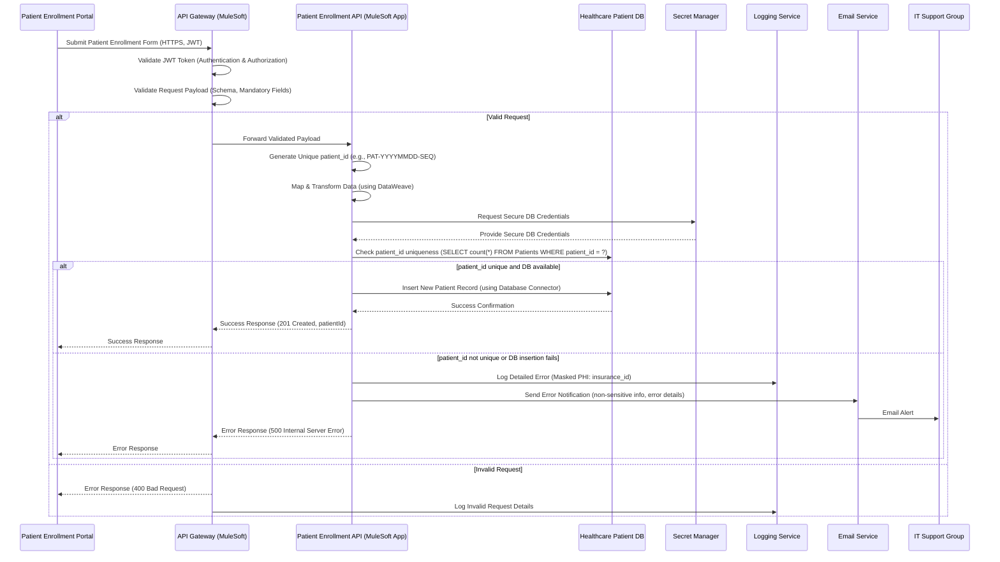

# High-Level Design (HLD) Document: Patient Enrollment System Integration

## 1. Introduction

This High-Level Design (HLD) document outlines the architecture for integrating the Patient Enrollment Portal with the Healthcare Patient Database. The primary goal is to automate and secure the patient registration process, ensuring data accuracy, protection of Protected Health Information (PHI), and efficient error handling. This design addresses the provided user stories and adheres to the specified technical constraints, leveraging MuleSoft as the integration platform.

## 2. Overall System Architecture

The system architecture adopts an API-led connectivity approach, with a dedicated MuleSoft API acting as the integration layer. This API will be deployed on CloudHub or the hospital’s private healthcare cloud, providing a secure and scalable endpoint for the Patient Enrollment Portal.

The architecture comprises:
*   **Patient Enrollment Portal:** The source system initiating patient enrollment.
*   **API Gateway:** Enforces security policies (JWT validation, HTTPS) and performs initial request validation. This is typically part of the MuleSoft runtime or API Manager.
*   **Patient Enrollment API Application (MuleSoft):** The core integration logic, responsible for data transformation, uniqueness checks, and database insertion.
*   **Healthcare Patient DB:** The target system for storing new patient records (PostgreSQL / Oracle).
*   **Secret Manager:** Securely stores sensitive credentials, such as database access details.
*   **Logging Service:** Captures detailed operational and error logs, with sensitive data masking.
*   **Email Service:** Facilitates notifications to the IT Support Group upon critical failures.

### 2.1. Architecture Diagram

```mermaid
graph TD
    subgraph "External Systems"
        PEP[Patient Enrollment Portal]
    end

    subgraph "Integration Layer (MuleSoft on CloudHub/Private Cloud)"
        API_GW[(API Gateway / Policy Enforcement)]
        MuleApp[Patient Enrollment API Application]
        EmailS[Email Service Connector]
        DBConn[Database Connector]
        SecretM[Secret Manager (for DB Creds)]
        Logger[Logging Service]
    end

    subgraph "Backend Systems"
        HDB[Healthcare Patient DB (PostgreSQL/Oracle)]
        ITSupport[IT Support Group (Email)]
    end

    PEP -- HTTPS (JWT Auth) --> API_GW
    API_GW -- Validated Request --> MuleApp
    MuleApp -- DataWeave Transformation --> MuleApp
    MuleApp -- Secure DB Connection --> DBConn
    DBConn -- Insert Patient Data --> HDB
    MuleApp -- Retrieve DB Creds --> SecretM
    MuleApp -- Error Details (Masked PHI) --> Logger
    MuleApp -- Error Notification --> EmailS
    EmailS -- Alert --> ITSupport
```

## 3. API Design

A single RESTful API endpoint will be exposed to handle patient enrollment submissions.

### 3.1. API Endpoint Definition

*   **Endpoint:** `POST /patients/enroll`
*   **Method:** `POST`
*   **Description:** Submits new patient enrollment data for processing and storage.
*   **Security:** Requires valid JWT for authentication and authorization. All communication over HTTPS.

### 3.2. Request Format

**Content-Type:** `application/json`

```json
{
    "patientFullName": "Jane Doe",
    "dateOfBirth": "1985-06-20",
    "gender": "Female",
    "address": "456 Oak Ave",
    "city": "Springfield",
    "stateRegion": "IL",
    "postalCode": "62704",
    "phoneNumber": "+12175551234",
    "insurancePolicyNumber": "XYZ987654321"
}
```

### 3.3. Response Formats

**Success Response (HTTP 201 Created):**
```json
{
    "status": "success",
    "message": "Patient enrolled successfully.",
    "patientId": "PAT-20230001"
}
```

**Error Response (HTTP 400 Bad Request - for validation errors):**
```json
{
    "status": "error",
    "code": "BAD_REQUEST",
    "message": "Invalid input data: 'dateOfBirth' is required and must be in YYYY-MM-DD format."
}
```

**Error Response (HTTP 500 Internal Server Error - for system failures):**
```json
{
    "status": "error",
    "code": "INTERNAL_SERVER_ERROR",
    "message": "An unexpected error occurred during patient enrollment. Please contact support."
}
```

### 3.4. API Specification

The API will be formally defined using **RAML** or **OpenAPI** specification. This specification will detail the `POST /patients/enroll` endpoint, its expected request payload schema, response structures, and security requirements (JWT). This document will be published for Patient Enrollment Portal developers to consume.

### 3.5. Request Validation

Initial validation of incoming requests will occur at the API Gateway level (MuleSoft API Manager). This includes:
*   **Schema Validation:** Ensuring the request payload conforms to the defined RAML/OpenAPI schema (e.g., correct data types, valid formats).
*   **Mandatory Field Checks:** Verifying the presence of all required fields.
*   Invalid requests will be rejected with an HTTP 400 Bad Request status and an informative error message.

## 4. Data Models & Database Schema

### 4.1. Logical Data Model (Patient)

The logical data model represents the core information captured for each patient.

*   `Patient Full Name` (String)
*   `Date of Birth` (Date)
*   `Gender` (String)
*   `Address` (String)
*   `City` (String)
*   `State/Region` (String)
*   `Postal Code` (String)
*   `Phone Number` (String)
*   `Insurance Policy Number` (String)
*   `Patient ID` (String, system-generated, unique)

### 4.2. Physical Database Schema (`Patients` table)

The `Patients` table will be created in the Healthcare Patient DB (PostgreSQL / Oracle) to store the mapped patient data.

```sql
CREATE TABLE Patients (
    patient_id VARCHAR(50) PRIMARY KEY,
    patient_name VARCHAR(255) NOT NULL,
    dob DATE NOT NULL,
    gender VARCHAR(10),
    address_line1 VARCHAR(255),
    city VARCHAR(100),
    state VARCHAR(100),
    postal_code VARCHAR(20),
    contact_phone VARCHAR(50),
    insurance_id VARCHAR(100), -- Stored, but masked in logs
    created_at TIMESTAMP DEFAULT CURRENT_TIMESTAMP
);

-- Index for faster lookup and uniqueness check on patient_id
CREATE UNIQUE INDEX idx_patient_id ON Patients (patient_id);
```

**Data Mapping and Transformation (MuleSoft DataWeave):**
The MuleSoft application will use **DataWeave** to map and transform the incoming JSON payload fields to the `Patients` table columns.
*   `patientFullName` → `patient_name`
*   `dateOfBirth` → `dob`
*   `gender` → `gender`
*   `address` → `address_line1`
*   `city` → `city`
*   `stateRegion` → `state`
*   `postalCode` → `postal_code`
*   `phoneNumber` → `contact_phone`
*   `insurancePolicyNumber` → `insurance_id`
*   `patient_id` will be system-generated by the API logic, ensuring uniqueness before insertion.

## 5. Data Flow

The following sequence details the flow of data from patient enrollment form submission to database insertion.



## 6. Security Considerations

Maintaining patient privacy and complying with healthcare regulations is paramount.

*   **API Security:**
    *   All API calls to the `POST /patients/enroll` endpoint will be authenticated and authorized using **JWT tokens**. These policies will be enforced at the API Gateway level (MuleSoft API Manager).
    *   All data in transit (API requests and responses) will be encrypted using **HTTPS** to protect PHI.
*   **Data Protection:**
    *   **Database credentials** for connecting to the Healthcare Patient DB will be stored securely in a **Secret Manager** (e.g., MuleSoft Secure Configuration Properties for CloudHub, or an enterprise secret management solution for private cloud deployments). They will be retrieved at runtime and never hardcoded.
    *   **Sensitive data masking** will be implemented for all system logs. Fields containing Protected Health Information (PHI) such as `insurance_id` (and any other potential PHI like SSN) will be automatically masked or redacted before logging.
*   **Deployment Environment Security:**
    *   Deployment on **CloudHub** leverages its robust platform-level security, including VPCs for network isolation and secure connectivity to backend systems.
    *   For **private healthcare cloud** deployments, equivalent network segmentation, firewall rules, and access controls will be configured to protect the MuleSoft runtime and restrict database access to authorized components only.

## 7. Error Handling & Logging

A comprehensive error handling strategy is crucial for operational stability and data integrity.

*   **Global Error Handler:** The MuleSoft application will implement a global error handler to gracefully manage all unhandled exceptions occurring during the patient enrollment process.
*   **Detailed Failure Logging:**
    *   Upon any failure (e.g., database unavailability, data validation error, duplicate `patient_id` during insertion, network connectivity issues), a detailed error message, the specific reason for failure, and relevant non-sensitive patient data will be logged.
    *   **Sensitive data (e.g., `insurance_id`) will be masked** in these logs to prevent PHI exposure.
    *   Logs will be directed to a centralized logging service for monitoring and analysis.
*   **Email Notification:**
    *   An **Email Connector** will be configured to send immediate notifications to the designated Healthcare IT Support Group upon critical failures (e.g., failed database insertions).
    *   The email notification will contain sufficient information to identify the failed transaction, the patient (using non-sensitive identifiers like a generated `patient_id` or a masked identifier), and the root cause of the error to aid prompt investigation.
*   **Informative Error Responses:** The API will return appropriate HTTP status codes (e.g., 400 Bad Request for client-side errors, 500 Internal Server Error for server-side issues) with clear, concise error messages to the Patient Enrollment Portal.

## 8. Deployment Strategy

The Patient Enrollment API will be deployed to ensure high availability, scalability, and security.

*   **CloudHub Deployment:**
    *   The MuleSoft application will be deployed as a CloudHub application.
    *   Utilize CloudHub VPCs for secure, private connectivity to the Healthcare Patient DB.
    *   Leverage CloudHub's auto-scaling features for handling varying loads.
*   **Private Healthcare Cloud Deployment:**
    *   Alternatively, the MuleSoft application can be deployed on a Mule Runtime instance within the hospital's private cloud environment (e.g., on virtual machines or containers).
    *   This deployment option ensures data residency and strict adherence to internal IT policies.
    *   Network connectivity to the Healthcare Patient DB will be established via private links, VPNs, or direct connect, ensuring secure communication.

## 9. Technology Stack Summary

This design strictly adheres to the specified technology stack:

*   **Integration Platform:** MuleSoft
*   **Deployment Environment:** CloudHub / Private Healthcare Cloud
*   **API Specification:** RAML/OpenAPI
*   **Database Connector:** MuleSoft Database Connector
*   **Email Connector:** MuleSoft Email Connector
*   **Data Transformation:** DataWeave (MuleSoft's native data transformation language)
*   **Security:** JWT (for API authentication/authorization), HTTPS (for data in transit encryption), Secret Manager (for database credentials), Sensitive Data Masking (for logging).
*   **Source System:** Patient Enrollment Portal (web/mobile)
*   **Target Database:** Healthcare Patient DB (PostgreSQL / Oracle Healthcare instance)