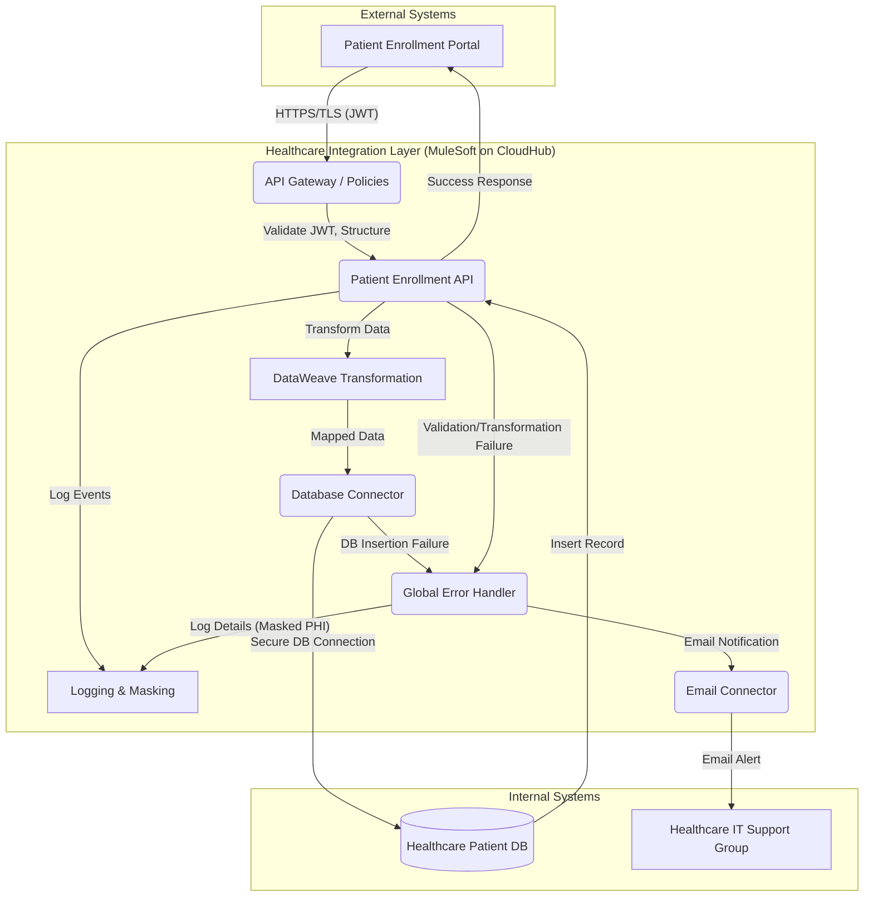

# High-Level Design (HLD) Document: Patient Enrollment System Integration

## 1. Introduction

This High-Level Design (HLD) document outlines the architecture for integrating a Patient Enrollment Portal with a central Healthcare Patient Database. The primary goal is to securely submit new patient enrollment data, transform it, create new patient records, and ensure robust error handling and data security. This system will leverage MuleSoft as the integration platform, deployed on CloudHub, to provide a secure, scalable, and maintainable solution.

## 2. Overall Architecture

### 2.1 Architectural Style

The system will adopt an API-led connectivity approach, specifically implementing a System API layer. A single RESTful API will be developed to serve as the integration point for the Patient Enrollment Portal. This API will encapsulate the logic for data reception, validation, transformation, and secure persistence into the Patient Management Database.

### 2.2 Components and Responsibilities

The architecture consists of the following key components:

*   **Patient Enrollment Portal (Source System):**
    *   Initiates the patient enrollment process.
    *   Collects patient data.
    *   Submits enrollment form data to the Patient Enrollment API endpoint.
*   **Patient Enrollment API (MuleSoft Application):**
    *   Deployed on CloudHub / Private Healthcare Cloud.
    *   Exposes a secure HTTPS endpoint.
    *   Performs initial request validation and JWT token validation.
    *   Handles data transformation using DataWeave.
    *   Manages secure database insertion using the Database Connector.
    *   Implements global error handling, logging, and email notifications for failures using the Email Connector.
    *   Masks sensitive data in logs.
*   **Healthcare Patient DB (Target Database):**
    *   Securely stores patient records.
    *   Receives new patient records from the Patient Enrollment API.
    *   Assumed to be a PostgreSQL or Oracle Healthcare instance.
*   **IT Support Group:**
    *   Receives email notifications for system failures.

### 2.3 Deployment Model

The Patient Enrollment API (MuleSoft application) will be deployed to **CloudHub** (or the hospital’s private cloud environment). This provides a managed, scalable, and secure environment for the API. The API will be exposed via a dedicated HTTPS endpoint, ensuring secure communication.

## 3. Data Models

### 3.1 Source Data Model (Patient Enrollment Portal Payload)

The Patient Enrollment Portal will submit data in a JSON format. Below is an example of the expected payload structure:

```json
{
  "patientFullName": "John Doe",
  "dateOfBirth": "1980-01-15",
  "gender": "Male",
  "address": "123 Main St",
  "city": "Anytown",
  "stateRegion": "CA",
  "postalCode": "90210",
  "phoneNumber": "555-123-4567",
  "insurancePolicyNumber": "INS-789012345"
}
```

### 3.2 Target Data Model (Patient Management Database Schema)

The transformed data will conform to the `Patients` table schema in the Healthcare Patient DB.

| Field Name              | Data Type      | Constraints             | Description                                   |
| :---------------------- | :------------- | :---------------------- | :-------------------------------------------- |
| `patient_id`            | VARCHAR(50)    | PRIMARY KEY, NOT NULL   | Unique system-generated Patient ID            |
| `patient_name`          | VARCHAR(255)   | NOT NULL                | Full name of the patient                      |
| `dob`                   | DATE           | NOT NULL                | Patient's date of birth                       |
| `gender`                | VARCHAR(10)    | NOT NULL                | Patient's gender (e.g., Male, Female, Other)  |
| `address_line1`         | VARCHAR(255)   |                         | First line of patient's address               |
| `city`                  | VARCHAR(100)   |                         | City of residence                             |
| `state`                 | VARCHAR(50)    |                         | State or region of residence                  |
| `postal_code`           | VARCHAR(20)    |                         | Postal code                                   |
| `contact_phone`         | VARCHAR(50)    |                         | Patient's primary phone number                |
| `insurance_id`          | VARCHAR(100)   |                         | Insurance policy number                       |
| `created_at`            | TIMESTAMP      | DEFAULT CURRENT_TIMESTAMP | Timestamp of record creation                  |
| `updated_at`            | TIMESTAMP      | DEFAULT CURRENT_TIMESTAMP | Timestamp of last update                      |

## 4. Database Schema

The `Patients` table will be created in the Healthcare Patient DB (e.g., PostgreSQL).

```sql
CREATE TABLE Patients (
    patient_id VARCHAR(50) PRIMARY KEY NOT NULL,
    patient_name VARCHAR(255) NOT NULL,
    dob DATE NOT NULL,
    gender VARCHAR(10) NOT NULL,
    address_line1 VARCHAR(255),
    city VARCHAR(100),
    state VARCHAR(50),
    postal_code VARCHAR(20),
    contact_phone VARCHAR(50),
    insurance_id VARCHAR(100),
    created_at TIMESTAMP DEFAULT CURRENT_TIMESTAMP,
    updated_at TIMESTAMP DEFAULT CURRENT_TIMESTAMP
);

-- Add index for patient_name for faster lookups if needed
CREATE INDEX idx_patient_name ON Patients (patient_name);
```

## 5. API Design

### 5.1 API Specification

The API will be defined using RAML or OpenAPI, describing its resources, methods, request/response formats, and security schemes.

**Example RAML 1.0 Definition:**

```raml
#%RAML 1.0
title: Patient Enrollment API
version: v1
baseUri: https://api.{env}.healthcare.com/patient-enrollment/api/v1
mediaType: application/json

securitySchemes:
  bearerAuth:
    type: OAuth 2.0
    description: Bearer token for API authentication
    settings:
      authorizationGrants: [ client_credentials ]
      accessTokenUri: https://auth.healthcare.com/oauth/token

traits:
  secured: !include traits/secured.raml

/patients:
  type: !include types/patient-enrollment-request.raml
  post:
    is: [ secured ]
    displayName: Enroll New Patient
    description: Submits new patient enrollment data to create a record.
    body:
      application/json:
        type: PatientEnrollmentRequest
        example:
          patientFullName: "Jane Doe"
          dateOfBirth: "1990-05-20"
          gender: "Female"
          address: "456 Oak Ave"
          city: "Springfield"
          stateRegion: "IL"
          postalCode: "62704"
          phoneNumber: "555-987-6543"
          insurancePolicyNumber: "INS-11223344"
    responses:
      201:
        description: Patient record created successfully.
        body:
          application/json:
            type: object
            properties:
              message:
                type: string
                example: "Patient record created successfully."
              patientId:
                type: string
                example: "PAT-UUID-12345"
      400:
        description: Bad Request - Invalid input data.
        body:
          application/json:
            type: object
            properties:
              error:
                type: string
                example: "Invalid payload structure or data types."
      401:
        description: Unauthorized - Missing or invalid JWT token.
        body:
          application/json:
            type: object
            properties:
              error:
                type: string
                example: "Unauthorized: Invalid or missing JWT token."
      500:
        description: Internal Server Error - Failed to process request or database error.
        body:
          application/json:
            type: object
            properties:
              error:
                type: string
                example: "Internal Server Error: Failed to create patient record."
```

**`types/patient-enrollment-request.raml` (Example):**

```raml
#%RAML 1.0 DataType
type: object
properties:
  patientFullName:
    type: string
    required: true
    description: Full name of the patient.
  dateOfBirth:
    type: string
    format: date
    required: true
    description: Patient's date of birth (YYYY-MM-DD).
  gender:
    type: string
    enum: [ "Male", "Female", "Other" ]
    required: true
    description: Patient's gender.
  address:
    type: string
    required: true
    description: Patient's street address.
  city:
    type: string
    required: true
    description: Patient's city.
  stateRegion:
    type: string
    required: true
    description: Patient's state or region.
  postalCode:
    type: string
    required: true
    description: Patient's postal code.
  phoneNumber:
    type: string
    required: true
    description: Patient's contact phone number.
  insurancePolicyNumber:
    type: string
    required: true
    description: Patient's insurance policy number.
```

**`traits/secured.raml` (Example):**

```raml
#%RAML 1.0 Trait
usage: Apply this to methods that require authentication.
securedBy: [ bearerAuth ]
```

### 5.2 Endpoints

*   **Endpoint:** `/api/v1/patients`
*   **Method:** `POST`
*   **Description:** Submits new patient enrollment data.
*   **Request Body:** `application/json` (as per `PatientEnrollmentRequest` type).
*   **Response:**
    *   `201 Created`: On successful patient record creation.
    *   `400 Bad Request`: If input data is invalid.
    *   `401 Unauthorized`: If JWT token is missing or invalid.
    *   `500 Internal Server Error`: For any processing or database errors.

### 5.3 Security Mechanisms

*   **JWT Token Validation:** All incoming requests to `/api/v1/patients` will be secured using JWT tokens. A MuleSoft API Gateway policy (e.g., JWT Validation Policy) will be applied to the API to validate the token's signature, expiration, and claims. Requests with invalid or missing tokens will be rejected with a `401 Unauthorized` response.
*   **PHI Encryption in Transit:** The API endpoint will be exposed via HTTPS/TLS, ensuring that all Protected Health Information (PHI) transmitted between the Patient Enrollment Portal and the API is encrypted during transit.

## 6. Data Flow

The following steps describe the data flow for a new patient enrollment:

1.  **Enrollment Submission:** The Patient Enrollment Portal captures patient data and submits it as a JSON payload via an HTTPS `POST` request to the Patient Enrollment API endpoint (`/api/v1/patients`). The request includes a JWT token in the `Authorization` header.
2.  **API Gateway / Policy Enforcement (MuleSoft):**
    *   The MuleSoft application receives the request.
    *   A JWT Validation Policy authenticates the calling system by validating the provided JWT token.
    *   If the JWT is invalid or missing, the request is rejected with a `401 Unauthorized` error.
    *   HTTPS/TLS ensures data encryption in transit.
3.  **Initial Request Validation:** The MuleSoft application performs initial validation of the incoming JSON payload against the defined API schema (e.g., using APIKit Router for RAML/OpenAPI). This checks for structural correctness and data types. Invalid requests receive a `400 Bad Request` error.
4.  **Data Transformation (DataWeave):**
    *   If validation passes, the raw enrollment data is transformed using **DataWeave**.
    *   A unique `patient_id` is generated (e.g., using MuleSoft's UUID generation functions).
    *   The source fields (`patientFullName`, `dateOfBirth`, etc.) are mapped to the target database schema fields (`patient_name`, `dob`, etc.).
5.  **Database Insertion (Database Connector):**
    *   The transformed data is prepared for insertion.
    *   The **MuleSoft Database Connector** is used to establish a secure connection to the Healthcare Patient DB. Database credentials are securely stored (e.g., in CloudHub's secure properties or an external secrets manager).
    *   An `INSERT` statement is executed to create a new record in the `Patients` table.
6.  **Error Handling & Notification:**
    *   If the database insertion fails (e.g., duplicate `patient_id`, DB unavailable, network error), a global error handler is triggered.
    *   The failure details are logged with sufficient information for diagnosis, ensuring sensitive data like `insurance_id` is masked.
    *   The **MuleSoft Email Connector** sends an email notification to the designated Healthcare IT support group.
    *   The API returns an appropriate `500 Internal Server Error` response to the Patient Enrollment Portal.
7.  **Successful Response:** If the database insertion is successful, the API returns a `201 Created` response to the Patient Enrollment Portal, including a success message and the newly generated `patientId`.

## 7. Security Considerations

*   **Authentication (API):** JWT tokens are mandatory for all API calls to ensure only authorized systems can interact with the API. A MuleSoft policy will enforce this.
*   **Data in Transit Encryption (PHI):** All communication between the Patient Enrollment Portal and the Patient Enrollment API (and potentially to the database, depending on network configuration) will use HTTPS/TLS to encrypt PHI.
*   **Database Credential Security:** Database connection credentials will be securely stored (e.g., using secure properties in MuleSoft deployed to CloudHub or an external secrets management service) and never exposed in plain text.
*   **Logging Masking:** Sensitive data, specifically `insurance_id` and any other identified PHI, will be masked in all system logs to maintain patient privacy and comply with regulations. This will be implemented via custom log4j configurations or MuleSoft's DataWeave transformations before logging. Masked data will not be easily reversible.
*   **Input Validation:** Robust input validation at the API entry point (schema validation) and during data transformation helps prevent injection attacks and ensures data integrity.

## 8. Error Handling & Monitoring

*   **Global Error Handler:** A centralized error handling mechanism will be implemented in the MuleSoft application. This handler will catch exceptions at various stages of the flow (API validation, transformation, database operations).
*   **Failure Logging:** All errors and failures will be logged with detailed context (e.g., payload, error message, stack trace) using MuleSoft's logging framework. Crucially, sensitive data (like `insurance_id`) will be masked in these logs.
*   **Email Notifications:** In case of critical failures, particularly database insertion errors (including duplicate `patient_id`), the MuleSoft Email Connector will send an immediate email alert to the Healthcare IT support group.
*   **Monitoring:** MuleSoft's Anypoint Monitoring will be utilized to track API performance, error rates, and other operational metrics, providing real-time visibility into the system's health.

## 9. Deployment Strategy

The Patient Enrollment API (MuleSoft application) will be packaged as a deployable archive and deployed to **CloudHub**. This involves:

1.  **CI/CD Pipeline:** Utilizing a CI/CD pipeline (e.g., Jenkins, Azure DevOps, GitHub Actions) to automate building, testing, and deploying the MuleSoft application to CloudHub.
2.  **Environment Configuration:** Separate environments (e.g., Dev, Test, Prod) will be maintained on CloudHub, with environment-specific configurations (e.g., database URLs, credentials, email recipients) managed via CloudHub properties and secure properties.
3.  **Scalability:** CloudHub's elastic scaling capabilities will allow the API to automatically scale resources based on demand, ensuring high availability and performance.
4.  **High Availability:** CloudHub's architecture inherently provides high availability by distributing application instances across multiple workers and zones.

## 10. Diagrams

### 10.1 High-Level Architecture Diagram



### 10.2 Data Flow Diagram

```mermaid
sequenceDiagram
    participant PEP as Patient Enrollment Portal
    participant PE_API as Patient Enrollment API (MuleSoft)
    participant DB as Healthcare Patient DB
    participant IT_Support as IT Support Group

    PEP->>PE_API: 1. Submit Enrollment Data (HTTPS, JWT)
    activate PE_API
    PE_API->>PE_API: 2. Validate JWT Token (API Gateway Policy)
    alt Invalid JWT
        PE_API-->>PEP: 401 Unauthorized
    else Valid JWT
        PE_API->>PE_API: 3. Validate Request Payload (Schema)
        alt Invalid Payload
            PE_API-->>PEP: 400 Bad Request
            PE_API->>PE_API: Log Failure (Masked PHI)
            PE_API->>IT_Support: Email Notification (via Email Connector)
        else Valid Payload
            PE_API->>PE_API: 4. Generate Patient ID & Transform Data (DataWeave)
            PE_API->>DB: 5. Insert New Patient Record (DB Connector)
            activate DB
            alt DB Insertion Failure (e.g., Duplicate ID, DB Error)
                DB-->>PE_API: Error Response
                deactivate DB
                PE_API->>PE_API: 6a. Global Error Handler triggered
                PE_API->>PE_API: 6b. Log Failure (Masked PHI)
                PE_API->>IT_Support: 6c. Email Notification (via Email Connector)
                PE_API-->>PEP: 500 Internal Server Error
            else Successful DB Insertion
                DB-->>PE_API: Success Response
                deactivate DB
                PE_API->>PE_API: 7. Log Success (Masked PHI)
                PE_API-->>PEP: 8. 201 Created (with Patient ID)
            end
        end
    end
    deactivate PE_API
```