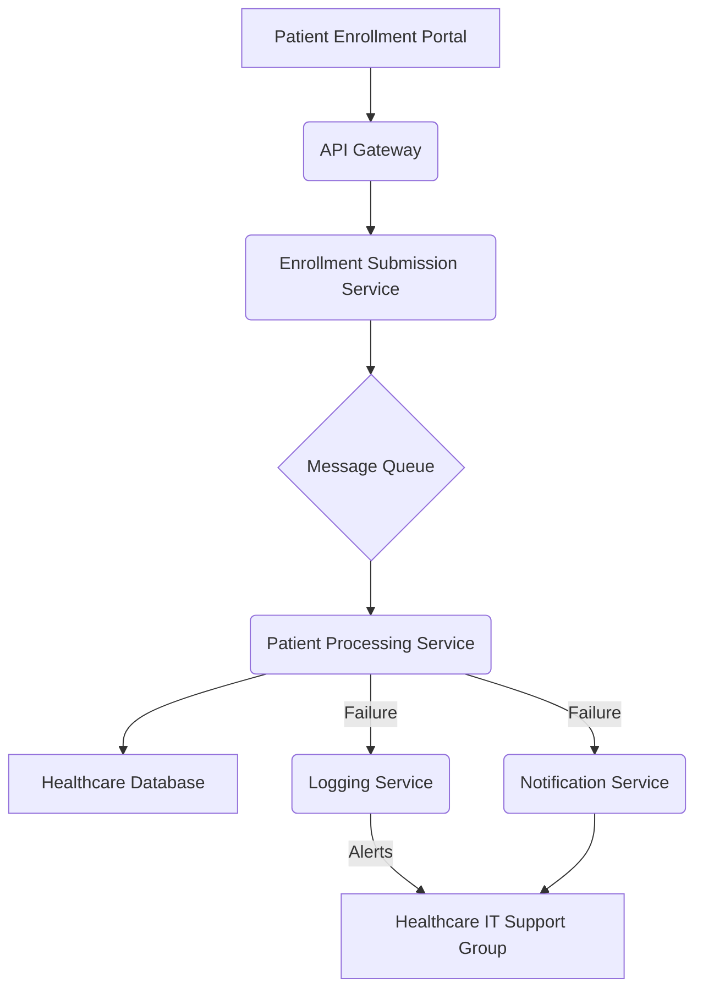
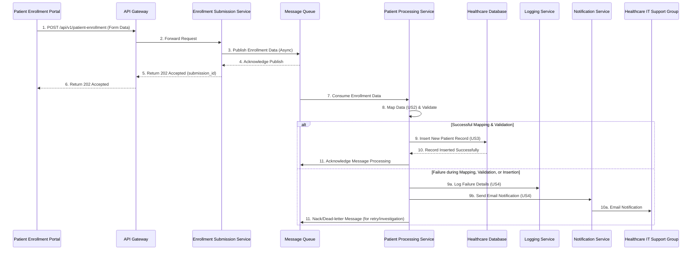

## High-Level Design (HLD) for Patient Enrollment Processing System

## 1. Introduction
This document outlines the High-Level Design for the Patient Enrollment Processing System. The system's primary goal is to efficiently and reliably process new patient enrollment data, map it to a standardized schema, store it in the healthcare database, and handle any failures gracefully through logging and notifications. The design adheres to an event-driven, microservices-oriented architecture.

## 2. Architecture Overview
The system adopts an event-driven, microservices-oriented architecture to ensure scalability, resilience, and loose coupling between components. Patient enrollment submissions trigger an asynchronous processing flow, allowing the frontend portal to remain responsive while backend operations occur.

### 2.1. Architectural Diagram


### 2.2. Component Descriptions

*   **Patient Enrollment Portal:** (Conceptual) The user-facing application where patients or administrators submit enrollment forms. It interacts with the API Gateway to submit enrollment data.
*   **API Gateway:** Acts as the entry point for all patient enrollment submissions. It provides a secure, scalable, and rate-limited interface for external systems to interact with the backend. It validates incoming requests and forwards them to the Enrollment Submission Service.
*   **Enrollment Submission Service:** A lightweight microservice responsible for receiving valid enrollment data from the API Gateway and publishing it to a Message Queue for asynchronous processing. This ensures the submission is acknowledged quickly, and actual processing is decoupled.
*   **Message Queue:** A reliable, durable message queue (e.g., a cloud-native service like AWS SQS, Azure Service Bus, or a self-hosted solution like RabbitMQ/Kafka) that decouples the submission process from the actual patient data processing. It ensures that enrollment data is not lost and can be processed even if downstream services are temporarily unavailable.
*   **Patient Processing Service:** The core backend microservice responsible for consuming messages from the Message Queue. It performs data mapping (US2), validation, and attempts to insert new patient records into the Healthcare Database (US3). It also incorporates robust error handling, logging, and notification mechanisms (US4).
*   **Healthcare Database:** The central relational database (e.g., PostgreSQL, MySQL, SQL Server) where all patient records are stored (US3). It contains the `Patients` table and other related healthcare data.
*   **Logging Service:** A centralized logging solution (e.g., a cloud-native service like AWS CloudWatch Logs, Azure Monitor, GCP Cloud Logging, or an ELK stack) where all system events, errors, and operational metrics are recorded. The Patient Processing Service sends detailed failure information here (US4).
*   **Notification Service:** A service responsible for sending automated notifications (e.g., email via SendGrid, Mailgun, or an internal SMTP server). It is invoked by the Patient Processing Service upon critical failures to alert the Healthcare IT Support Group (US4).
*   **Healthcare IT Support Group:** The recipient of failure notifications and responsible for monitoring logs and resolving issues.

## 3. Data Models and Database Schema

### 3.1. Patient Enrollment Form Data Structure
This represents the raw data submitted by the portal via the API.

```json
{
    "patient_full_name": "John Doe",
    "patient_id_system_generated": "PAT-2023-0001",
    "date_of_birth": "1990-01-15",
    "gender": "Male",
    "address": "123 Main St",
    "city": "Anytown",
    "state_region": "CA",
    "postal_code": "90210",
    "phone_number": "+15551234567",
    "insurance_policy_number": "INS-ABC-12345"
}
```

### 3.2. Healthcare Database Schema (`Patients` Table)
This table stores the mapped patient records.

**Table: `Patients`**

| Field Name        | Data Type   | Constraints          | Description                                    | Maps from Form Field                  |
| :---------------- | :---------- | :------------------- | :--------------------------------------------- | :------------------------------------ |
| `patient_id`      | VARCHAR(50) | PRIMARY KEY, NOT NULL | Unique identifier for the patient.             | "Patient ID (system-generated)"       |
| `patient_name`    | VARCHAR(255)| NOT NULL             | Full name of the patient.                      | "Patient Full Name"                   |
| `dob`             | DATE        | NOT NULL             | Date of birth of the patient.                  | "Date of Birth"                       |
| `gender`          | VARCHAR(10) | NOT NULL             | Gender of the patient.                         | "Gender"                              |
| `address_line1`   | VARCHAR(255)| NULLABLE             | Primary address line.                          | "Address"                             |
| `city`            | VARCHAR(100)| NULLABLE             | City of residence.                             | "City"                                |
| `state`           | VARCHAR(50) | NULLABLE             | State or region of residence.                  | "State/Region"                        |
| `postal_code`     | VARCHAR(20) | NULLABLE             | Postal code.                                   | "Postal Code"                         |
| `contact_phone`   | VARCHAR(20) | NULLABLE             | Patient's contact phone number.                | "Phone Number"                        |
| `insurance_id`    | VARCHAR(100)| NULLABLE             | Insurance policy number.                       | "Insurance Policy Number"             |
| `created_at`      | TIMESTAMP   | NOT NULL, DEFAULT NOW() | Timestamp when the record was created.       | (System-generated)                    |
| `updated_at`      | TIMESTAMP   | NOT NULL, DEFAULT NOW() | Timestamp when the record was last updated.  | (System-generated)                    |

**SQL DDL for `Patients` Table (Example for PostgreSQL):**

```sql
CREATE TABLE Patients (
    patient_id VARCHAR(50) PRIMARY KEY NOT NULL,
    patient_name VARCHAR(255) NOT NULL,
    dob DATE NOT NULL,
    gender VARCHAR(10) NOT NULL,
    address_line1 VARCHAR(255),
    city VARCHAR(100),
    state VARCHAR(50),
    postal_code VARCHAR(20),
    contact_phone VARCHAR(20),
    insurance_id VARCHAR(100),
    created_at TIMESTAMP NOT NULL DEFAULT NOW(),
    updated_at TIMESTAMP NOT NULL DEFAULT NOW()
);
```

## 4. API Endpoints

### 4.1. `POST /api/v1/patient-enrollment`

*   **Description:** Submits a new patient enrollment form for processing.
*   **User Story:** US1
*   **Method:** `POST`
*   **Endpoint:** `/api/v1/patient-enrollment`
*   **Request Body (JSON):**
    ```json
    {
        "patient_full_name": "John Doe",
        "patient_id_system_generated": "PAT-2023-0001",
        "date_of_birth": "1990-01-15",
        "gender": "Male",
        "address": "123 Main St",
        "city": "Anytown",
        "state_region": "CA",
        "postal_code": "90210",
        "phone_number": "+15551234567",
        "insurance_policy_number": "INS-ABC-12345"
    }
    ```
*   **Response (JSON):**
    *   **Success (202 Accepted):** Indicates the request has been successfully received and queued for asynchronous processing.
        ```json
        {
            "status": "success",
            "message": "Patient enrollment request received and queued for processing.",
            "submission_id": "SUB-XYZ-7890"
        }
        ```
    *   **Bad Request (400 Bad Request):** Returned if the input data fails schema validation or basic business rule checks at the API Gateway level.
        ```json
        {
            "status": "error",
            "message": "Invalid input data.",
            "details": [
                {"field": "patient_full_name", "error": "Cannot be empty"},
                {"field": "date_of_birth", "error": "Invalid date format"}
            ]
        }
        ```
    *   **Internal Server Error (500 Internal Server Error):** Returned for unexpected errors within the API Gateway or immediate downstream service.
        ```json
        {
            "status": "error",
            "message": "An unexpected error occurred while processing the submission.",
            "error_code": "ERR-001"
        }
        ```

## 5. Data Flow

### 5.1. Patient Enrollment Processing Data Flow Diagram


### 5.2. Detailed Data Flow Steps

1.  **Patient Submits Form:** The Patient Enrollment Portal sends a `POST` request containing the enrollment form data to the API Gateway.
2.  **API Gateway Routes Request:** The API Gateway receives the request, performs initial validation (e.g., schema validation, authentication), and routes it to the Enrollment Submission Service.
3.  **Enrollment Submission Service Publishes Message:** The Enrollment Submission Service receives the data, assigns a unique `submission_id`, and publishes the raw enrollment data as a message to the Message Queue.
4.  **Message Queue Acknowledges:** The Message Queue acknowledges receipt of the message, confirming it's safely queued.
5.  **Submission Service Responds:** The Enrollment Submission Service returns a `202 Accepted` response to the API Gateway, including the `submission_id`, indicating that the request has been accepted for processing.
6.  **API Gateway Responds to Portal:** The API Gateway forwards the `202 Accepted` response to the Patient Enrollment Portal.
7.  **Patient Processing Service Consumes Message:** The Patient Processing Service continuously polls or receives messages from the Message Queue.
8.  **Data Mapping and Validation:** Upon consuming a message, the Patient Processing Service performs the following:
    *   **Mapping (US2):** It accurately maps the fields from the incoming enrollment form data to the `Patients` table schema (as specified in US2 and Section 3.2).
    *   **Validation:** It validates the mapped data against the database schema constraints and any additional business rules (e.g., `dob` is a valid date, `patient_id` uniqueness check if applicable, `gender` conforms to expected values).
9.  **Database Interaction (US3):**
    *   **Success Path:** If mapping and validation are successful, the Patient Processing Service constructs an SQL `INSERT` statement and executes it against the Healthcare Database to create a new patient record.
    *   **Failure Path (US4):** If any issue occurs during mapping, validation, or database insertion (e.g., constraint violation, database unavailability, network error):
        *   **Log Failure:** The Patient Processing Service logs the failure details to the Logging Service.
        *   **Send Notification:** The Patient Processing Service sends an email notification to the Healthcare IT Support Group via the Notification Service.
        *   The message in the Message Queue is either negatively acknowledged (NACK) or moved to a Dead-Letter Queue (DLQ) for further investigation or retry policies.
10. **Database Acknowledges:** The Healthcare Database confirms the successful insertion or reports an error.
11. **Message Acknowledgment:**
    *   **Success:** If the record is successfully inserted, the Patient Processing Service acknowledges the message in the Message Queue, removing it from the queue.
    *   **Failure:** If an error occurred, the message is handled according to defined retry policies (e.g., retried a few times for transient errors, then moved to a DLQ for persistent errors) to prevent infinite loops and allow manual intervention.

## 6. Error Handling and Logging (US4)

The Patient Processing Service is central to robust error handling, logging, and notification.

*   **Logging Details (as per feedback from previous review):**
    *   All processing steps, success, and failure events are logged to the Logging Service.
    *   When a failure occurs during patient record creation, the system logs the following detailed information:
        *   `timestamp`: The exact UTC timestamp when the failure occurred.
        *   `error_message`: The specific technical error message or exception details (e.g., "SQLSTATE[23505]: Unique violation: 7 ERROR: duplicate key value violates unique constraint 'patients_pkey'").
        *   `error_type`: A categorized error type to facilitate filtering and analysis (e.g., `DATABASE_UNIQUE_CONSTRAINT_VIOLATION`, `DATA_VALIDATION_ERROR`, `DATABASE_CONNECTION_ERROR`).
        *   `submission_id`: The unique identifier for the original enrollment submission that triggered the processing.
        *   `patient_id_attempted`: The `patient_id` value that the system attempted to insert or update.
        *   `affected_form_context`: A summary or identifier of the original form data (e.g., `{"patient_full_name": "John Doe", "dob": "1990-01-15"}`).
        *   `service_instance_id`: Identifier of the specific Patient Processing Service instance that encountered the error.
        *   `trace_id`: A correlation ID to link logs across different services for a single request.

*   **Notification Content (as per feedback from previous review):**
    *   In case of critical failures (e.g., database insertion failure, unrecoverable data validation errors), the Notification Service is triggered to send an email.
    *   The email notification sent to the "Healthcare IT support group" will include:
        *   **Subject:** `[CRITICAL] Patient Enrollment Processing Failure - Submission ID: [submission_id]`
        *   **Body:**
            *   "Dear Healthcare IT Support Group,"
            *   "This is an automated notification regarding a critical failure in the Patient Enrollment Processing System."
            *   "**Failure Type:** [Error Type, e.g., DATABASE_UNIQUE_CONSTRAINT_VIOLATION]"
            *   "**Error Message:** [Specific error message, e.g., 'Duplicate entry for patient ID 'PAT-2023-0001']"
            *   "**Affected Patient Enrollment Details:**"
                *   "Submission ID: [submission_id]"
                *   "Patient Name (attempted): [patient_full_name from form]"
                *   "Patient ID (attempted): [patient_id_system_generated from form]"
            *   "**Timestamp of Failure:** [timestamp of failure]"
            *   "**Log Reference:** A detailed log entry for this failure can be found in the Logging Service. Please search using `submission_id: [submission_id]` or `trace_id: [trace_id]`."
            *   "Please investigate this issue promptly."
            *   "Sincerely,"
            *   "Patient Enrollment System Automated Bot"

*   **Retry Mechanisms:**
    *   The Message Queue is configured with retry policies for transient errors (e.g., temporary database unavailability). Messages will be retried a configurable number of times.
    *   For persistent errors (e.g., data validation errors, unique constraint violations), messages will be moved to a Dead-Letter Queue (DLQ) after retries are exhausted. The DLQ allows for manual inspection, correction of data, and re-processing without blocking the main queue.