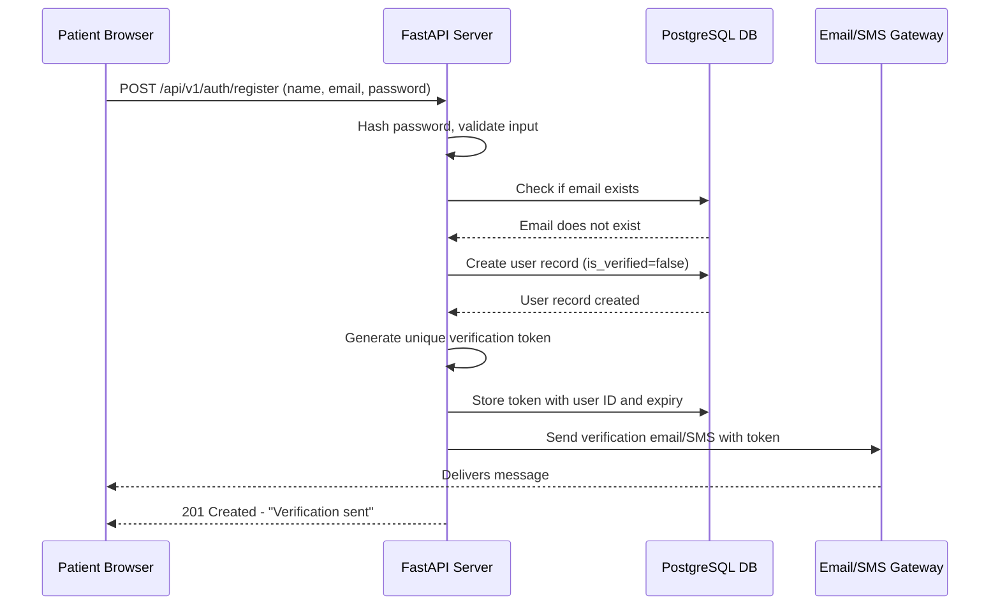
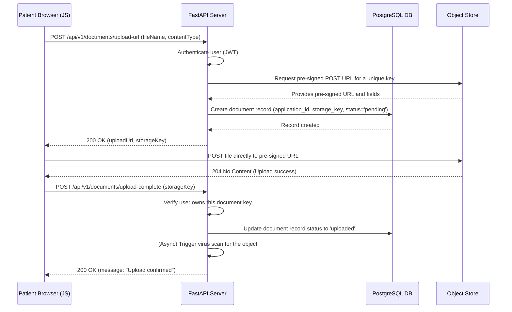

# High-Level Design (HLD): Patient Enrollment Application

## 1. Introduction

### 1.1. Purpose
This document outlines the high-level design and system architecture for the Patient Enrollment Application. The system is designed to provide a secure, compliant, and user-friendly platform for patients to enroll in a healthcare program, and for providers/admins to manage these applications.

### 1.2. Scope
The scope of this HLD covers the end-to-end architecture, including the frontend, backend services, data storage, security measures, and API design. It is based on the provided user stories and technical constraints, addressing patient onboarding, application management, provider workflows, and non-functional requirements such as security, performance, and accessibility.

### 1.3. Key Terms & Acronyms
*   **HLD:** High-Level Design
*   **SRS:** Software Requirements Specification
*   **PHI:** Protected Health Information
*   **HIPAA:** Health Insurance Portability and Accountability Act
*   **GDPR:** General Data Protection Regulation
*   **CCPA:** California Consumer Privacy Act
*   **API:** Application Programming Interface
*   **RBAC:** Role-Based Access Control
*   **CSP:** Content Security Policy
*   **BDD:** Behavior-Driven Development

---

## 2. Architecture Overview

### 2.1. Architectural Style: Modular Monolith
The system will be built as a **Modular Monolith**. This approach is chosen over a microservices architecture for the following reasons:
*   **Simplicity:** A monolithic application is simpler to develop, test, and deploy initially, reducing operational overhead.
*   **Adherence to Constraints:** The specified tech stack (Python backend, PostgreSQL) fits well within a single, cohesive codebase.
*   **Performance:** Direct in-process communication between modules is faster than network calls between microservices.
*   **Future-Proofing:** The application will be designed with clear logical boundaries between modules (e.g., auth, enrollment, admin). This modularity allows for easier maintenance and future migration to microservices if scaling demands it.

The application will be a traditional **Multi-Page Application (MPA)**. The Python backend will render HTML templates on the server, and vanilla JavaScript will be used on the client-side for interactivity, validation, and asynchronous requests (AJAX) where necessary.

### 2.2. System Architecture Diagram
This diagram illustrates the main components and their interactions.

```mermaid
graph TD
    subgraph "User Devices"
        Browser[<B>User Browser</B><br/>(Desktop/Mobile)<br/>HTML5, JavaScript]
    end

    subgraph "Cloud Infrastructure (HIPAA-Compliant)"
        LB[<B>Load Balancer</B><br/>TLS Termination, Rate Limiting]

        subgraph "Application Tier"
            WebApp[<B>Python FastAPI Application</B><br/>(Modular Monolith)<br/>- Auth Module<br/>- Enrollment Module<br/>- Admin Module<br/>- Notification Module]
        end

        subgraph "Data Tier"
            DB[(<B>PostgreSQL Database</B><br/>Encrypted at Rest)]
            ObjectStore[(<B>S3-Compatible Object Store</B><br/>Encrypted at Rest)]
        end

        subgraph "External Services"
            Email[<B>Email Gateway</B><br/>(e.g., AWS SES)]
            SMS[<B>SMS Gateway</B><br/>(e.g., Twilio)]
        end
    end

    Browser -- HTTPS --> LB
    LB -- HTTP --> WebApp
    WebApp -- CRUD Operations --> DB
    WebApp -- Generates Pre-signed URLs --> Browser
    WebApp -- Manages Metadata --> DB
    Browser -- Uploads/Downloads via Pre-signed URL --> ObjectStore
    WebApp -- Sends Notifications --> Email
    WebApp -- Sends Verifications --> SMS
```

---

## 3. Component Design

### 3.1. Frontend Application (HTML5 + Vanilla JavaScript)
*   **Rendering:** The application will be server-side rendered. The FastAPI backend will use the Jinja2 templating engine to generate and serve HTML pages.
*   **Structure:** This will be a standard Multi-Page Application (MPA). Each major user action (e.g., navigating to the dashboard, moving to the next form step) will result in a new page load from the server.
*   **Client-Side Logic (Vanilla JS):**
    *   **Form Validation:** Provide real-time feedback on input fields (e.g., password strength, valid email format) before form submission.
    *   **Interactivity:** Power features like the progress bar, document upload progress, and the digital signature pad.
    *   **AJAX:** Used sparingly for features that require dynamic updates without a full page reload, such as checking application status on the dashboard or performing searches on the FAQ page.
*   **Accessibility (WCAG 2.2 AA):** The server-rendered HTML will be semantic. All interactive elements built with JavaScript will use appropriate ARIA attributes to be accessible to screen readers.

### 3.2. Backend Application (Python - FastAPI)
The backend will be a single FastAPI application organized into logical modules.

*   **Core Framework:** FastAPI is chosen for its high performance, asynchronous capabilities, and automatic generation of OpenAPI documentation. Its dependency injection system and Pydantic-based data validation are ideal for building robust and secure APIs.

*   **Logical Modules:**
    1.  **Authentication & Authorization Module:**
        *   Handles user registration, email/SMS verification, login, and password management.
        *   Implements JWT-based session management.
        *   Enforces Role-Based Access Control (RBAC) using FastAPI dependencies to protect endpoints.
    2.  **Enrollment Module:**
        *   Manages the logic for the multi-step enrollment form.
        *   Handles saving partial progress and final submission.
        *   Manages consent capture and logging.
    3.  **Document Management Module:**
        *   Generates secure, time-limited pre-signed URLs for direct-to-object-store uploads from the client.
        *   Handles metadata for uploaded documents.
        *   Integrates with a background process or lambda function for virus scanning of new uploads.
    4.  **Admin & Provider Module:**
        *   Provides endpoints for the admin/provider dashboard to list, filter, and view applications.
        *   Contains the business logic for approving, rejecting, or requesting more information on applications.
        *   Manages the audit trail for all admin/provider actions.
    5.  **Notifications Module:**
        *   Abstracts the communication with external email and SMS gateways.
        *   Sends transactional messages like verification codes and status updates.
    6.  **Informational Content Module:**
        *   Serves static pages (FAQ, Privacy Policy).
        *   Implements the search functionality for the FAQ page, potentially using PostgreSQL's full-text search capabilities.
    7.  **Support Module:**
        *   Handles the contact form submission and routes it to the support queue (e.g., by creating a ticket in the database and sending an email to a support distribution list).
    8.  **BDD Generation Tool:**
        *   A command-line script within the project repository (e.g., `manage.py generate_feature <use_case>`). It will use predefined Gherkin templates and populate them based on the specified use case, enabling developers and QA to quickly generate feature files.

### 3.3. Data Storage
*   **PostgreSQL Database:**
    *   **Purpose:** Stores all structured data including user accounts, patient information, application metadata, statuses, audit logs, and consent records.
    *   **Security:** Data will be encrypted at rest using PostgreSQL's native Transparent Data Encryption (TDE) or by using the `pgcrypto` extension for column-level encryption of specific PHI fields.
*   **S3-Compatible Object Store:**
    *   **Purpose:** Stores all unstructured binary files, such as uploaded identity documents, insurance cards, and generated consent forms (PDFs).
    *   **Security:** All objects will be encrypted at rest using Server-Side Encryption (e.g., SSE-S3). Access will be strictly controlled via pre-signed URLs. Buckets will be configured to be private by default.

---

## 4. Data Model and Database Schema

Below are the primary tables for the PostgreSQL database.

```sql
-- Users table for authentication and roles
CREATE TABLE users (
    id UUID PRIMARY KEY DEFAULT gen_random_uuid(),
    email VARCHAR(255) UNIQUE,
    phone_number VARCHAR(50) UNIQUE,
    password_hash VARCHAR(255) NOT NULL,
    role VARCHAR(20) NOT NULL CHECK (role IN ('patient', 'provider', 'admin')),
    is_verified BOOLEAN NOT NULL DEFAULT FALSE,
    created_at TIMESTAMPTZ NOT NULL DEFAULT NOW(),
    updated_at TIMESTAMPTZ NOT NULL DEFAULT NOW()
);

-- Patient-specific PII/PHI data, linked to a user account
CREATE TABLE patients (
    id UUID PRIMARY KEY DEFAULT gen_random_uuid(),
    user_id UUID NOT NULL REFERENCES users(id) ON DELETE CASCADE,
    full_name_encrypted TEXT NOT NULL, -- Example of an encrypted field
    date_of_birth_encrypted TEXT NOT NULL,
    ssn_encrypted TEXT,
    address_encrypted TEXT,
    created_at TIMESTAMPTZ NOT NULL DEFAULT NOW(),
    updated_at TIMESTAMPTZ NOT NULL DEFAULT NOW()
);

-- Main table for the enrollment application workflow
CREATE TABLE enrollment_applications (
    id UUID PRIMARY KEY DEFAULT gen_random_uuid(),
    patient_id UUID NOT NULL REFERENCES patients(id),
    status VARCHAR(50) NOT NULL DEFAULT 'pending', -- e.g., pending, submitted, in_review, action_required, approved, rejected
    application_data_jsonb JSONB, -- Stores multi-step form data
    submitted_at TIMESTAMPTZ,
    last_updated_by UUID REFERENCES users(id),
    created_at TIMESTAMPTZ NOT NULL DEFAULT NOW(),
    updated_at TIMESTAMPTZ NOT NULL DEFAULT NOW()
);

-- Metadata for uploaded documents
CREATE TABLE uploaded_documents (
    id UUID PRIMARY KEY DEFAULT gen_random_uuid(),
    application_id UUID NOT NULL REFERENCES enrollment_applications(id),
    document_type VARCHAR(100) NOT NULL, -- e.g., 'id_proof', 'insurance_card'
    file_name VARCHAR(255) NOT NULL,
    storage_key VARCHAR(1024) NOT NULL UNIQUE, -- Path in the object store
    file_size_bytes BIGINT,
    mime_type VARCHAR(100),
    virus_scan_status VARCHAR(50) NOT NULL DEFAULT 'pending', -- pending, clean, infected
    uploaded_at TIMESTAMPTZ NOT NULL DEFAULT NOW()
);

-- Records the capture of digital consent
CREATE TABLE consent_logs (
    id UUID PRIMARY KEY DEFAULT gen_random_uuid(),
    application_id UUID NOT NULL REFERENCES enrollment_applications(id),
    consent_type VARCHAR(100) NOT NULL, -- e.g., 'terms_of_service', 'privacy_policy'
    is_signed BOOLEAN NOT NULL DEFAULT FALSE,
    ip_address VARCHAR(45) NOT NULL,
    user_agent TEXT,
    timestamp TIMESTAMPTZ NOT NULL DEFAULT NOW(),
    signed_document_key VARCHAR(1024) -- Link to the generated PDF in object store
);

-- Audit trail for sensitive actions
CREATE TABLE audit_logs (
    id BIGSERIAL PRIMARY KEY,
    user_id UUID REFERENCES users(id),
    action VARCHAR(255) NOT NULL, -- e.g., 'VIEWED_PATIENT_RECORD', 'APPROVED_APPLICATION'
    target_entity_type VARCHAR(100),
    target_entity_id UUID,
    details JSONB,
    timestamp TIMESTAMPTZ NOT NULL DEFAULT NOW()
);
```

---

## 5. API Design (RESTful)

The API will be versioned (e.g., `/api/v1/...`). Authentication will be managed via JWTs sent in the `Authorization: Bearer <token>` header.

### 5.1. Authentication Endpoints
*   **`POST /api/v1/auth/register`**
    *   **Description:** Creates a new patient user account.
    *   **Request Body:** `{ "name": "Jane Doe", "email": "jane.doe@example.com", "phoneNumber": "+15551234567", "password": "StrongPassword123!" }`
    *   **Success Response (201):** `{ "message": "Verification email/SMS sent." }`
*   **`POST /api/v1/auth/login`**
    *   **Description:** Authenticates a user and returns a JWT.
    *   **Request Body:** `{ "username": "jane.doe@example.com", "password": "StrongPassword123!" }`
    *   **Success Response (200):** `{ "access_token": "ey...", "token_type": "bearer" }`

### 5.2. Enrollment Endpoints
*   **`POST /api/v1/enrollment/applications`**
    *   **Description:** Creates or updates an enrollment application (for saving progress).
    *   **Request Body:** `{ "step": "personal_details", "formData": { ... } }`
    *   **Success Response (200):** `{ "applicationId": "uuid...", "status": "pending" }`
*   **`GET /api/v1/enrollment/applications/me`**
    *   **Description:** Retrieves the current user's application details and status.
    *   **Success Response (200):** `{ "applicationId": "uuid...", "status": "in_review", "formData": { ... } }`

### 5.3. Document Management Endpoints
*   **`POST /api/v1/documents/upload-url`**
    *   **Description:** Generates a pre-signed URL for a direct client-side upload.
    *   **Request Body:** `{ "fileName": "id_proof.pdf", "contentType": "application/pdf", "documentType": "id_proof" }`
    *   **Success Response (200):** `{ "uploadUrl": "https://...", "storageKey": "path/to/object" }`

### 5.4. Admin/Provider Endpoints
*   **`GET /api/v1/admin/applications`**
    *   **Description:** Lists all applications with sorting and filtering.
    *   **Query Params:** `?status=in_review&sortBy=date&order=desc`
    *   **Success Response (200):** `[ { "applicationId": "...", "patientName": "John Smith", "status": "in_review", "submittedAt": "..." } ]`
*   **`POST /api/v1/admin/applications/{app_id}/status`**
    *   **Description:** Updates the status of an application (approve, reject, etc.).
    *   **Request Body:** `{ "newStatus": "approved", "reason": "All documents verified." }`
    *   **Success Response (200):** `{ "message": "Application status updated successfully." }`

---

## 6. Security and Compliance

*   **Data in Transit:** All communication between the client and the server will be encrypted using HTTPS/TLS 1.2+. The load balancer will enforce this policy.
*   **Data at Rest:**
    *   **PostgreSQL:** Sensitive PHI columns (e.g., name, SSN, DOB) will be encrypted using `pgcrypto`. The entire database cluster will also have storage-level encryption enabled.
    *   **Object Store:** Server-Side Encryption (SSE-S3) will be enabled by default for the documents bucket.
*   **Authentication & Authorization:**
    *   Stateless authentication using JWTs.
    *   Strict RBAC will be enforced at the API level using FastAPI's dependency injection. For example, a dependency will check the user's role from the JWT payload before allowing access to an admin endpoint.
*   **HIPAA Compliance:**
    *   **Access Control:** RBAC ensures the principle of least privilege.
    *   **Audit Controls:** The `audit_logs` table will record all events involving PHI access or modification.
    *   **Integrity:** Database constraints and secure coding practices will ensure data integrity.
    *   **Transmission Security:** TLS 1.2+ for all data in transit.
*   **Other Measures:**
    *   **Rate Limiting:** Implemented at the load balancer or via middleware (e.g., `slowapi`) to prevent brute-force attacks on login and registration endpoints.
    *   **Content Security Policy (CSP):** A strict CSP header will be set on all server responses to mitigate XSS attacks.
    *   **Input Validation:** Pydantic models in FastAPI will automatically validate all incoming request data against defined schemas, preventing injection attacks.
    *   **Virus Scanning:** All uploaded files will be scanned asynchronously before being made accessible to providers.

---

## 7. Data Flow Diagrams

### 7.1. Patient Registration Flow


### 7.2. Secure Document Upload Flow
This flow uses pre-signed URLs to ensure large files do not pass through the application server, improving performance and security.



---

## 8. Addressing Non-Functional Requirements

*   **Performance:**
    *   **LCP < 2.5s:** Achieved by server-side rendering (fast initial paint), optimizing frontend assets (minification, compression), and using a CDN to serve static assets.
    *   **API Response < 500ms:** FastAPI's asynchronous nature, combined with efficient database queries (with proper indexing) and a stateless architecture, will ensure low latency.
*   **Scalability:**
    *   The stateless nature of the FastAPI application allows for horizontal scaling by adding more instances behind the load balancer.
    *   The PostgreSQL database can be scaled vertically or moved to a managed, scalable service. The object store is inherently scalable.
*   **Accessibility (WCAG 2.2 AA):**
    *   Backend templates will generate semantic HTML5 (`<nav>`, `<main>`, `<form>`, `<label>`).
    *   Client-side JavaScript will manage ARIA attributes for dynamic components (e.g., `aria-live` for status updates) to ensure screen reader compatibility.
*   **Deployment (CI/CD):**
    *   A standard CI/CD pipeline will be established (e.g., using GitHub Actions).
    *   **Workflow:** On merge to `main`/`develop` -> Run linters & automated tests -> Build Docker image -> Push to container registry -> Deploy to Staging -> Run integration/E2E tests -> Manual approval -> Deploy to Production.