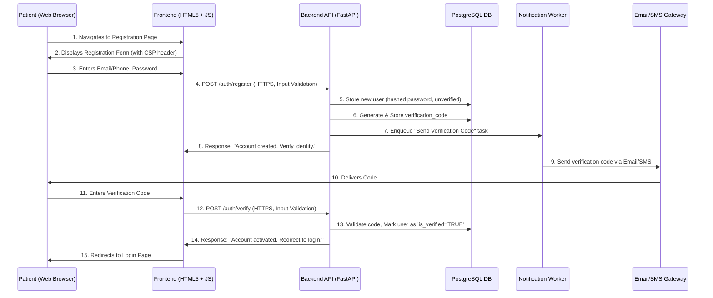

# High-Level Design (HLD) for Patient Enrollment Application

## 1. Introduction

This document outlines the High-Level Design (HLD) for a Patient Enrollment Application, addressing the provided user stories and technical constraints. The system will enable prospective patients to securely register, complete a multi-step enrollment form, upload documents, provide digital consent, and track their application status. Concurrently, healthcare providers and administrators will have a secure dashboard to review, approve, or reject applications. The design prioritizes security, compliance (HIPAA, GDPR/CCPA), performance, and accessibility.

## 2. Architectural Overview

The application adopts a modular, service-oriented architecture using Python FastAPI for the backend APIs, a standard HTML5 + JavaScript frontend, PostgreSQL for relational data, and an object store for unstructured documents. This setup allows for clear separation of concerns, scalability, and maintainability.

### 2.1. High-Level Architecture Diagram

```mermaid
graph TD
    subgraph Client Applications
        A[Web Browser (HTML5 + JavaScript)]
    end

    subgraph Backend Services (Python FastAPI)
        B[API Gateway / Core Service]
        B -- Handles: --> B1(Authentication & User Management)
        B -- Handles: --> B2(Patient Enrollment & Profile)
        B -- Handles: --> B3(Document Management)
        B -- Handles: --> B4(Consent Management)
        B -- Handles: --> B5(Provider/Admin Management)
        B -- Handles: --> B6(Public Content & Search)
        B -- Triggers Async: --> C(Notification Service / Background Worker)
        B -- Triggers Async: --> D(Document Processing Service / Background Worker)
        B -- Triggers Async: --> E(BDD Feature Generator)
    end

    subgraph External Services
        F[Email / SMS Gateway]
    end

    subgraph Data Stores
        G[PostgreSQL Database]
        H[Object Storage (e.g., S3-compatible)]
    end

    A -- HTTPS --> B
    B1 -- Reads/Writes securely --> G
    B2 -- Reads/Writes securely --> G
    B3 -- Stores/Retrieves securely --> H
    B3 -- Updates metadata securely --> G
    B4 -- Reads/Writes securely --> G
    B5 -- Reads/Writes securely --> G
    B6 -- Reads securely --> G
    B -- Communicates with --> C
    C -- Sends notifications via --> F
    C -- Updates notification status in --> G
    B -- Communicates with --> D
    D -- Performs Virus Scan & OCR on --> H
    B -- Communicates with --> E
    E -- Generates & serves --> A
```

### 2.2. Components Description

*   **Web Browser (HTML5 + JavaScript Frontend)**:
    *   Responsive, mobile-friendly UI for patients and providers/admins.
    *   Handles user interaction, form submissions, and displays data retrieved from backend APIs.
    *   Implements client-side input validation and accessibility features.
    *   Adheres to Content Security Policy (CSP) headers sent by the backend for enhanced security.
*   **API Gateway / Core Service (Python FastAPI)**:
    *   The central backend application, providing RESTful APIs.
    *   Built with FastAPI, leveraging its performance and automatic OpenAPI documentation.
    *   Responsible for routing requests, authentication, authorization (RBAC), data validation, and interacting with data stores and other services.
    *   Includes modules for:
        *   **Authentication & User Management**: Handles user registration, login, verification, password reset, session management, and rate limiting.
        *   **Patient Enrollment & Profile**: Manages patient profiles and the multi-step enrollment form data (save, retrieve, submit).
        *   **Document Management**: Orchestrates document uploads, manages metadata, and triggers asynchronous processing.
        *   **Consent Management**: Records and retrieves digital consent data.
        *   **Provider/Admin Management**: Provides APIs for the admin dashboard, application review, status updates, and audit logging.
        *   **Public Content & Search**: Serves public information and handles global site search queries.
*   **Notification Service / Background Worker (Python)**:
    *   An asynchronous worker (could be a separate process or a background task within FastAPI) responsible for sending email/SMS notifications.
    *   Processes notification events (e.g., status changes, verification codes) from the Core Service.
    *   Interacts with external Email/SMS Gateways.
*   **Document Processing Service / Background Worker (Python)**:
    *   An asynchronous worker triggered upon document upload.
    *   Responsible for security tasks like virus/malware scanning of uploaded documents.
    *   Could potentially handle other tasks like OCR or metadata extraction if required in the future.
*   **BDD Feature Generator (Python)**:
    *   A module within the FastAPI application, accessible via an admin-only API.
    *   Generates Gherkin feature files based on predefined use case templates.
*   **PostgreSQL Database**:
    *   Primary data store for all structured data: user accounts, profiles, enrollment application details, consent records, notification logs, audit logs, and configuration.
    *   Ensures data integrity, transactional consistency, and supports complex queries.
    *   All sensitive data is encrypted at rest.
*   **Object Storage**:
    *   Used for storing unstructured binary data, specifically patient-uploaded documents (ID proofs, medical records, insurance cards).
    *   Provides high durability, scalability, and cost-effectiveness for large files.
    *   Implements appropriate access controls and encryption at rest.
*   **Email / SMS Gateway**:
    *   External services used for sending verification codes, password reset links, and application status notifications.
    *   Communication with these services will be secured via HTTPS.

## 3. Data Model (PostgreSQL Schema)

All sensitive patient data (e.g., personal information, medical history, insurance details, document metadata, consent records) will be encrypted at rest within the PostgreSQL database using appropriate column-level or disk-level encryption mechanisms.

```sql
-- Table for Users (Patients, Providers, Admins)
CREATE TABLE users (
    user_id UUID PRIMARY KEY DEFAULT gen_random_uuid(),
    email VARCHAR(255) UNIQUE NOT NULL,
    phone_number VARCHAR(20) UNIQUE, -- Optional, can be NULL if email is primary
    password_hash VARCHAR(255) NOT NULL,
    is_verified BOOLEAN DEFAULT FALSE,
    account_status VARCHAR(50) DEFAULT 'active', -- e.g., 'active', 'suspended', 'locked'
    created_at TIMESTAMP WITH TIME ZONE DEFAULT CURRENT_TIMESTAMP,
    updated_at TIMESTAMP WITH TIME ZONE DEFAULT CURRENT_TIMESTAMP
);

-- Table for User Roles (for RBAC)
CREATE TABLE roles (
    role_id UUID PRIMARY KEY DEFAULT gen_random_uuid(),
    role_name VARCHAR(50) UNIQUE NOT NULL -- e.g., 'patient', 'provider', 'admin', 'test_engineer'
);

-- Junction Table for User Roles
CREATE TABLE user_roles (
    user_id UUID NOT NULL REFERENCES users(user_id),
    role_id UUID NOT NULL REFERENCES roles(role_id),
    PRIMARY KEY (user_id, role_id)
);

-- Table for User Profiles (Patient specific details)
CREATE TABLE user_profiles (
    profile_id UUID PRIMARY KEY DEFAULT gen_random_uuid(),
    user_id UUID UNIQUE NOT NULL REFERENCES users(user_id),
    first_name VARCHAR(100),
    last_name VARCHAR(100),
    date_of_birth DATE,
    address JSONB, -- Stores structured address data
    -- Other personal/demographic info
    created_at TIMESTAMP WITH TIME ZONE DEFAULT CURRENT_TIMESTAMP,
    updated_at TIMESTAMP WITH TIME ZONE DEFAULT CURRENT_TIMESTAMP
);

-- Table for Verification Codes (Email/SMS)
CREATE TABLE verification_codes (
    code_id UUID PRIMARY KEY DEFAULT gen_random_uuid(),
    user_id UUID NOT NULL REFERENCES users(user_id),
    code VARCHAR(10) NOT NULL,
    type VARCHAR(50) NOT NULL, -- e.g., 'email_verification', 'phone_verification', 'password_reset'
    expires_at TIMESTAMP WITH TIME ZONE NOT NULL,
    is_used BOOLEAN DEFAULT FALSE,
    created_at TIMESTAMP WITH TIME ZONE DEFAULT CURRENT_TIMESTAMP
);

-- Table for Password Reset Tokens
CREATE TABLE password_reset_tokens (
    token_id UUID PRIMARY KEY DEFAULT gen_random_uuid(),
    user_id UUID NOT NULL REFERENCES users(user_id),
    token VARCHAR(255) NOT NULL UNIQUE,
    expires_at TIMESTAMP WITH TIME ZONE NOT NULL,
    is_used BOOLEAN DEFAULT FALSE,
    created_at TIMESTAMP WITH TIME ZONE DEFAULT CURRENT_TIMESTAMP
);

-- Table for Enrollment Applications
CREATE TABLE enrollment_applications (
    application_id UUID PRIMARY KEY DEFAULT gen_random_uuid(),
    user_id UUID NOT NULL REFERENCES users(user_id),
    current_status VARCHAR(50) NOT NULL DEFAULT 'Draft', -- e.g., 'Draft', 'Submitted', 'Under Review', 'Approved', 'Rejected', 'More Info Needed'
    submission_date TIMESTAMP WITH TIME ZONE,
    approved_by UUID REFERENCES users(user_id), -- Provider/Admin who approved
    rejection_reason TEXT,
    created_at TIMESTAMP WITH TIME ZONE DEFAULT CURRENT_TIMESTAMP,
    updated_at TIMESTAMP WITH TIME ZONE DEFAULT CURRENT_TIMESTAMP
);

-- Table for Multi-Step Enrollment Form Data
CREATE TABLE enrollment_steps_data (
    step_data_id UUID PRIMARY KEY DEFAULT gen_random_uuid(),
    application_id UUID NOT NULL REFERENCES enrollment_applications(application_id),
    step_name VARCHAR(100) NOT NULL, -- e.g., 'Personal Info', 'Medical History', 'Insurance Details'
    step_order INT NOT NULL,
    data JSONB NOT NULL, -- Stores encrypted JSON data for each step
    is_completed BOOLEAN DEFAULT FALSE,
    created_at TIMESTAMP WITH TIME ZONE DEFAULT CURRENT_TIMESTAMP,
    updated_at TIMESTAMP WITH TIME ZONE DEFAULT CURRENT_TIMESTAMP,
    UNIQUE (application_id, step_name)
);

-- Table for Uploaded Documents
CREATE TABLE documents (
    document_id UUID PRIMARY KEY DEFAULT gen_random_uuid(),
    application_id UUID NOT NULL REFERENCES enrollment_applications(application_id),
    user_id UUID NOT NULL REFERENCES users(user_id), -- Redundant but useful for direct lookup
    file_name VARCHAR(255) NOT NULL,
    file_type VARCHAR(100) NOT NULL, -- e.g., 'image/jpeg', 'application/pdf'
    object_storage_key VARCHAR(255) UNIQUE NOT NULL, -- Key/path in object storage
    document_type VARCHAR(100) NOT NULL, -- e.g., 'ID_Proof', 'Insurance_Card', 'Prescription'
    upload_date TIMESTAMP WITH TIME ZONE DEFAULT CURRENT_TIMESTAMP,
    is_scanned BOOLEAN DEFAULT FALSE, -- For virus scanning
    scan_status VARCHAR(50) DEFAULT 'Pending', -- 'Pending', 'Clean', 'Infected'
    created_at TIMESTAMP WITH TIME ZONE DEFAULT CURRENT_TIMESTAMP,
    updated_at TIMESTAMP WITH TIME ZONE DEFAULT CURRENT_TIMESTAMP
);

-- Table for Digital Consents
CREATE TABLE consents (
    consent_id UUID PRIMARY KEY DEFAULT gen_random_uuid(),
    application_id UUID NOT NULL REFERENCES enrollment_applications(application_id),
    user_id UUID NOT NULL REFERENCES users(user_id), -- Redundant but useful
    consent_type VARCHAR(100) NOT NULL, -- e.g., 'Privacy Policy', 'Terms of Service', 'Medical Consent'
    consent_text_version VARCHAR(50) NOT NULL, -- Version of the consent text
    is_given BOOLEAN NOT NULL, -- True for consent given
    consent_method VARCHAR(50) NOT NULL, -- e.g., 'checkbox', 'digital_signature'
    consent_timestamp TIMESTAMP WITH TIME ZONE DEFAULT CURRENT_TIMESTAMP,
    ip_address INET, -- For auditing
    user_agent TEXT, -- For auditing
    created_at TIMESTAMP WITH TIME ZONE DEFAULT CURRENT_TIMESTAMP,
    updated_at TIMESTAMP WITH TIME ZONE DEFAULT CURRENT_TIMESTAMP,
    UNIQUE (application_id, consent_type, consent_text_version) -- Prevent duplicate consent records for the same version
);

-- Table for Notifications
CREATE TABLE notifications (
    notification_id UUID PRIMARY KEY DEFAULT gen_random_uuid(),
    user_id UUID NOT NULL REFERENCES users(user_id),
    application_id UUID REFERENCES enrollment_applications(application_id), -- Optional, if notification is application-specific
    message TEXT NOT NULL,
    type VARCHAR(50) NOT NULL, -- e.g., 'email', 'in_app', 'sms'
    status VARCHAR(50) DEFAULT 'Pending', -- e.g., 'Pending', 'Sent', 'Failed', 'Read'
    send_at TIMESTAMP WITH TIME ZONE DEFAULT CURRENT_TIMESTAMP,
    read_at TIMESTAMP WITH TIME ZONE,
    created_at TIMESTAMP WITH TIME ZONE DEFAULT CURRENT_TIMESTAMP,
    updated_at TIMESTAMP WITH TIME ZONE DEFAULT CURRENT_TIMESTAMP
);

-- Table for Audit Logs (for critical actions, especially by Admins/Providers)
CREATE TABLE audit_logs (
    log_id UUID PRIMARY KEY DEFAULT gen_random_uuid(),
    user_id UUID REFERENCES users(user_id), -- User who performed the action
    action VARCHAR(255) NOT NULL, -- e.g., 'Application Approved', 'Document Viewed', 'Password Reset'
    entity_type VARCHAR(100), -- e.g., 'enrollment_application', 'user', 'document'
    entity_id UUID, -- ID of the entity affected
    details JSONB, -- Additional details about the action
    ip_address INET,
    timestamp TIMESTAMP WITH TIME ZONE DEFAULT CURRENT_TIMESTAMP
);

-- Table for Static Content Pages (FAQs, Privacy Policy, Terms - optional, could be static files)
CREATE TABLE content_pages (
    page_id UUID PRIMARY KEY DEFAULT gen_random_uuid(),
    slug VARCHAR(100) UNIQUE NOT NULL, -- e.g., 'faqs', 'privacy-policy', 'terms-of-service'
    title VARCHAR(255) NOT NULL,
    content TEXT NOT NULL,
    last_updated_by UUID REFERENCES users(user_id),
    updated_at TIMESTAMP WITH TIME ZONE DEFAULT CURRENT_TIMESTAMP
);
```

## 4. API Design (FastAPI)

All API endpoints will be secured with HTTPS, implement rate limiting, and perform input validation. Authentication will use JWTs or similar token-based mechanisms. Sensitive data in request/response bodies will be encrypted where appropriate.

### 4.1. Authentication & User Management

*   **POST /auth/register**
    *   **Description**: Registers a new patient account.
    *   **Request**: `{ "email": "string", "phone_number": "string", "password": "string" }`
    *   **Response**: `{ "message": "Account created. Please verify your identity.", "user_id": "uuid" }`
*   **POST /auth/verify**
    *   **Description**: Verifies user identity with a code received via email/SMS.
    *   **Request**: `{ "user_id": "uuid", "verification_code": "string" }`
    *   **Response**: `{ "message": "Account activated. You can now log in." }`
*   **POST /auth/login**
    *   **Description**: Authenticates a user and issues an access token.
    *   **Request**: `{ "email_or_phone": "string", "password": "string" }`
    *   **Response**: `{ "access_token": "string", "token_type": "bearer", "user_id": "uuid", "roles": ["patient"] }`
*   **POST /auth/forgot-password**
    *   **Description**: Initiates password reset by sending a link/code.
    *   **Request**: `{ "email_or_phone": "string" }`
    *   **Response**: `{ "message": "Password reset instructions sent." }`
*   **POST /auth/reset-password**
    *   **Description**: Resets password using a valid token/code.
    *   **Request**: `{ "reset_token": "string", "new_password": "string" }`
    *   **Response**: `{ "message": "Password has been reset successfully." }`
*   **POST /auth/logout**
    *   **Description**: Invalidates the current user session/token.
    *   **Request**: (Empty, token in header)
    *   **Response**: `{ "message": "Logged out successfully." }`

### 4.2. Patient Enrollment & Profile

*   **GET /patient/profile** (Authenticated Patient)
    *   **Description**: Retrieves the logged-in patient's profile.
    *   **Response**: `{ "first_name": "string", "last_name": "string", "date_of_birth": "date", ... }`
*   **PUT /patient/profile** (Authenticated Patient)
    *   **Description**: Updates the logged-in patient's profile.
    *   **Request**: `{ "first_name": "string", "last_name": "string", ... }`
    *   **Response**: `{ "message": "Profile updated successfully." }`
*   **GET /patient/applications/current** (Authenticated Patient)
    *   **Description**: Retrieves the current (or latest) enrollment application for the patient.
    *   **Response**: `{ "application_id": "uuid", "current_status": "string", "steps_data": [ {...} ], ... }`
*   **POST /patient/applications/start** (Authenticated Patient)
    *   **Description**: Starts a new enrollment application.
    *   **Request**: (Empty)
    *   **Response**: `{ "message": "New application started.", "application_id": "uuid" }`
*   **PUT /patient/applications/{application_id}/step/{step_name}** (Authenticated Patient)
    *   **Description**: Saves data for a specific step of the enrollment form.
    *   **Request**: `{ "data": { ... } }` (JSONB)
    *   **Response**: `{ "message": "Step data saved successfully." }`
*   **POST /patient/applications/{application_id}/submit** (Authenticated Patient)
    *   **Description**: Submits the completed enrollment application.
    *   **Request**: (Empty)
    *   **Response**: `{ "message": "Application submitted successfully.", "application_id": "uuid" }`

### 4.3. Document Management

*   **POST /patient/applications/{application_id}/documents** (Authenticated Patient)
    *   **Description**: Uploads a document for the application.
    *   **Request**: `multipart/form-data` with `file` and `document_type` fields.
    *   **Response**: `{ "message": "Document uploaded and awaiting scan.", "document_id": "uuid", "file_name": "string" }`
*   **GET /patient/applications/{application_id}/documents** (Authenticated Patient)
    *   **Description**: Lists all documents uploaded for an application.
    *   **Response**: `[ { "document_id": "uuid", "file_name": "string", "upload_date": "datetime", "document_type": "string", "scan_status": "string" } ]`
*   **DELETE /patient/documents/{document_id}** (Authenticated Patient)
    *   **Description**: Deletes an uploaded document.
    *   **Request**: (Empty)
    *   **Response**: `{ "message": "Document deleted successfully." }`

### 4.4. Consent Management

*   **GET /patient/applications/{application_id}/consents** (Authenticated Patient)
    *   **Description**: Retrieves the required consent forms for an application.
    *   **Response**: `[ { "consent_type": "string", "consent_text_version": "string", "is_given": "boolean", "text": "string" } ]`
*   **POST /patient/applications/{application_id}/consents** (Authenticated Patient)
    *   **Description**: Records patient's digital consent.
    *   **Request**: `{ "consent_type": "string", "consent_text_version": "string", "is_given": "boolean", "consent_method": "string", "signature_data": "string" (optional) }`
    *   **Response**: `{ "message": "Consent recorded successfully.", "consent_id": "uuid" }`

### 4.5. Notifications

*   **GET /patient/notifications** (Authenticated Patient)
    *   **Description**: Retrieves unread or recent in-app notifications for the patient.
    *   **Response**: `[ { "notification_id": "uuid", "message": "string", "type": "string", "send_at": "datetime", "read_at": "datetime" } ]`
*   **PUT /patient/notifications/{notification_id}/read** (Authenticated Patient)
    *   **Description**: Marks a specific notification as read.
    *   **Request**: (Empty)
    *   **Response**: `{ "message": "Notification marked as read." }`

### 4.6. Provider/Admin Management (RBAC controlled)

*   **GET /admin/applications** (Authenticated Provider/Admin)
    *   **Description**: Lists all enrollment applications, with optional filters (status, provider scope).
    *   **Response**: `[ { "application_id": "uuid", "patient_name": "string", "current_status": "string", "submission_date": "datetime" } ]`
*   **GET /admin/applications/{application_id}** (Authenticated Provider/Admin)
    *   **Description**: Retrieves full details of a specific enrollment application, including patient data, documents, and consents.
    *   **Response**: `{ "application_id": "uuid", "patient_info": { ... }, "enrollment_data": { ... }, "documents": [ ... ], "consents": [ ... ], "audit_history": [ ... ] }`
*   **GET /admin/documents/{document_id}/view** (Authenticated Provider/Admin)
    *   **Description**: Securely serves an uploaded document (e.g., as a stream or temporary signed URL).
    *   **Response**: Binary file stream or `{ "download_url": "string" }`
*   **PUT /admin/applications/{application_id}/status** (Authenticated Provider/Admin)
    *   **Description**: Updates the status of an application (Approved, Rejected, More Info Needed).
    *   **Request**: `{ "status": "string", "reason": "string" (optional), "required_info": "string" (if 'More Info Needed') }`
    *   **Response**: `{ "message": "Application status updated successfully." }`

### 4.7. Public Content & Search

*   **GET /public/faqs**
    *   **Description**: Retrieves FAQ content.
    *   **Response**: `{ "title": "FAQs", "content": "HTML content" }`
*   **GET /public/privacy-policy**
    *   **Description**: Retrieves Privacy Policy content.
    *   **Response**: `{ "title": "Privacy Policy", "content": "HTML content" }`
*   **GET /public/terms-of-service**
    *   **Description**: Retrieves Terms of Service content.
    *   **Response**: `{ "title": "Terms of Service", "content": "HTML content" }`
*   **POST /public/contact**
    *   **Description**: Submits a contact form query.
    *   **Request**: `{ "name": "string", "email": "string", "subject": "string", "message": "string" }`
    *   **Response**: `{ "message": "Your message has been sent. We will respond within X hours." }`
*   **GET /search**
    *   **Description**: Global site search for public content (FAQs, help articles).
    *   **Request**: `{ "query": "string" }`
    *   **Response**: `[ { "title": "string", "snippet": "string", "url": "string" } ]`

### 4.8. BDD Feature File Generation (RBAC controlled)

*   **POST /admin/generate-bdd-feature** (Authenticated Admin/Test Engineer)
    *   **Description**: Generates a Gherkin feature file for a given use case.
    *   **Request**: `{ "use_case_name": "string" }` (e.g., "Patient Registration", "Document Upload")
    *   **Response**: `{ "feature_file_content": "string", "file_name": "string" }` (The frontend can then offer this for download).

## 5. Key Technical Considerations & NFRs

### 5.1. Security & Compliance

*   **HTTPS Everywhere**: All communication between the client and backend, and between backend services and external gateways, will use HTTPS/TLS.
*   **Content Security Policy (CSP)**: The backend will send appropriate CSP headers for all frontend pages to mitigate XSS and data injection attacks. This explicitly addresses the feedback from the previous review.
*   **Encryption at Rest**:
    *   **PostgreSQL**: Sensitive patient data (e.g., `user_profiles.data`, `enrollment_steps_data.data`, `consents.signature_data`) will be encrypted at the column level or by leveraging PostgreSQL's transparent data encryption features.
    *   **Object Storage**: All uploaded documents will be stored encrypted at rest using server-side encryption (e.g., AES-256).
*   **Input Validation & Sanitization**: Rigorous validation on both frontend and backend to prevent common vulnerabilities like SQL injection, XSS, and buffer overflows.
*   **Rate Limiting**: Implemented at the API Gateway/Core Service level for authentication endpoints (login, registration, password reset) to prevent brute-force attacks.
*   **Authentication & Authorization (RBAC)**: JWT-based authentication for all authenticated endpoints. Role-Based Access Control (RBAC) will restrict access to specific functionalities (e.g., admin dashboard, BDD generation) based on user roles (`patient`, `provider`, `admin`, `test_engineer`).
*   **HIPAA / GDPR / CCPA Compliance**:
    *   Data Minimization: Only collect necessary data.
    *   Audit Logging: Comprehensive logging of all sensitive data access and modification (Story 6, Story 7 NFR).
    *   Consent Management: Detailed recording of patient consents (Story 4).
    *   Data Encryption and Access Controls are paramount.
*   **Virus/Malware Scanning**: All uploaded documents will undergo automated virus/malware scanning by the Document Processing Service before being made accessible or processed further (Story 3 NFR).

### 5.2. Performance (Story 11)

*   **Frontend Optimization**: HTML, CSS, JavaScript, and images will be minified, compressed (Gzip/Brotli), and lazy-loaded.
*   **Caching**: Implement caching mechanisms for static content (e.g., public pages, FAQs) and frequently accessed, less volatile data (e.g., application status lookups).
*   **Database Optimization**: Indexing on frequently queried columns, optimized SQL queries, and efficient data retrieval strategies.
*   **Asynchronous Operations**: Use FastAPI's async capabilities and background tasks for non-critical operations like sending notifications or document processing to avoid blocking API responses.
*   **LCP < 2.5s**: Frontend and backend performance will be continuously monitored to ensure the Largest Contentful Paint (LCP) remains below 2.5 seconds.

### 5.3. Accessibility (Story 10)

*   **WCAG 2.2 AA Compliance**: The entire frontend UI will be designed and developed to meet WCAG 2.2 AA guidelines, including semantic HTML, keyboard navigation, proper focus management, sufficient color contrast, and descriptive alternative text for non-text content.
*   **Automated and Manual Testing**: Regular automated accessibility scans and manual testing with assistive technologies will be conducted.

### 5.4. Scalability

*   **Stateless Backend**: FastAPI services will be largely stateless to allow for horizontal scaling.
*   **PostgreSQL**: Can be scaled vertically initially, and horizontally with read replicas or sharding if needed.
*   **Object Storage**: Inherently scalable for document storage.
*   **Asynchronous Processing**: Decoupling tasks like notifications and document scanning via background workers enhances overall system throughput.

### 5.5. Observability

*   **Logging**: Comprehensive logging for all services (access, error, audit logs).
*   **Monitoring**: Integration with performance monitoring tools to track LCP, API response times, database performance, and system health.
*   **Alerting**: Setup alerts for critical errors, performance degradation, and security incidents.

## 6. Data Flow Example (Patient Registration)

This diagram illustrates the data flow for Story 1: Patient Account Creation & Verification.



##