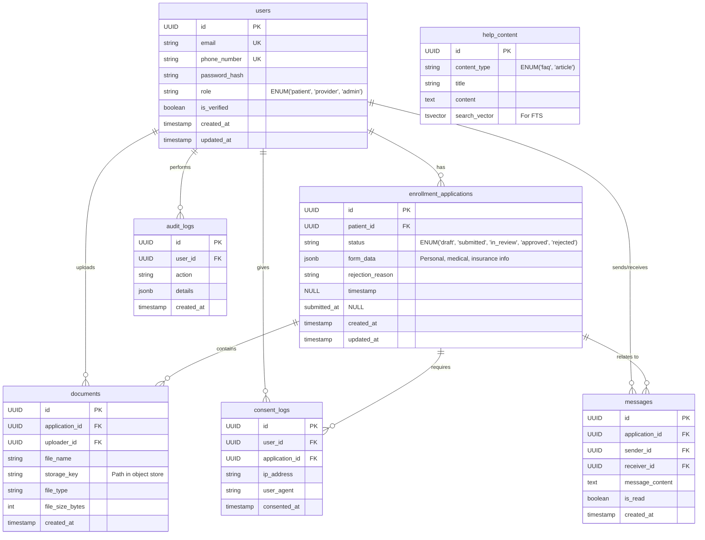
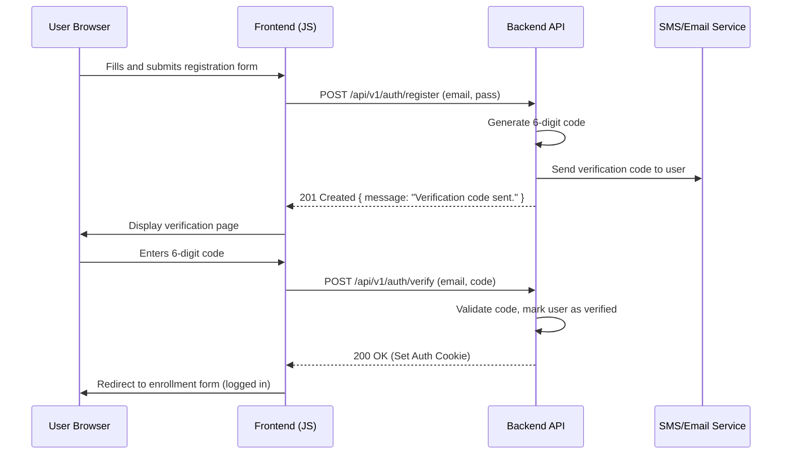
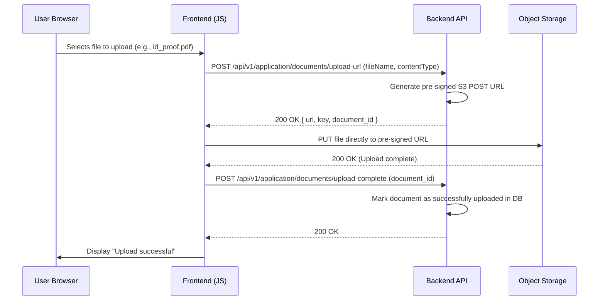
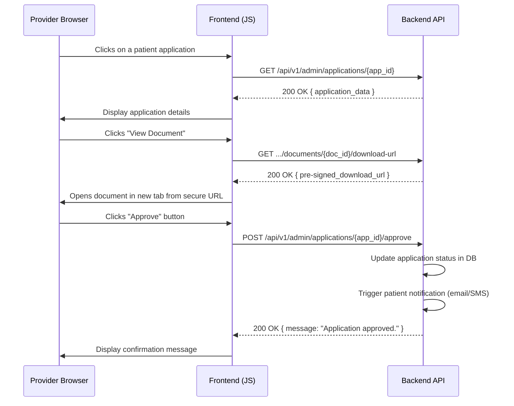

# High-Level Design (HLD): Patient Enrollment Portal

**Version:** 1.0
**Date:** October 26, 2023
**Author:** Solutions Architect

---

## 1. Introduction

### 1.1. Purpose
This document provides the High-Level Design (HLD) for the Patient Enrollment Portal. The system is designed to offer a seamless and secure experience for patients to learn about a healthcare program, register, submit their information and documents, and communicate with providers. It also provides a workflow for healthcare providers and administrators to review and manage these applications.

### 1.2. Scope
The scope of this HLD covers the system's architecture, data models, API design, and security considerations based on the provided user stories and technical constraints. It addresses functionalities for informational content, patient registration, document management, application status tracking, secure communication, and provider-side application management, while adhering to strict performance, accessibility, and data privacy regulations (HIPAA, GDPR/CCPA).

---

## 2. System Architecture

### 2.1. Architectural Style
A **Monolithic Architecture** is chosen for the backend, coupled with a **Static Site Frontend**. This approach is suitable for the defined scope, promoting simplicity in development, deployment, and maintenance. The backend will be a single, cohesive Python application serving a RESTful API. The frontend will consist of static HTML, CSS, and vanilla JavaScript files that interact with the backend API.

*   **Rationale:**
    *   **Simplicity:** A monolithic backend simplifies the initial development and deployment process, as there is only one application to manage.
    *   **Cohesion:** The features are tightly coupled and revolve around a central `EnrollmentApplication` domain, making a monolith a natural fit.
    *   **Performance:** Direct in-process communication between modules is faster than inter-service calls required by a microservices architecture.
    *   **Alignment with Constraints:** This model works perfectly with the specified tech stack without introducing unnecessary complexity like service discovery or distributed tracing.

### 2.2. Technology Stack

| Component           | Technology                               | Justification                                                                                             |
| ------------------- | ---------------------------------------- | --------------------------------------------------------------------------------------------------------- |
| **Frontend**        | HTML5, CSS3, Vanilla JavaScript          | As per technical requirements. Provides a responsive, accessible, and mobile-friendly user interface.     |
| **Backend API**     | Python 3.11+ with FastAPI                | Meets the Python requirement. FastAPI is chosen for its high performance, automatic API documentation, and built-in data validation with Pydantic. |
| **Database**        | PostgreSQL 15+                           | A powerful, open-source object-relational database system with strong support for JSONB, full-text search, and robust security features required for storing structured patient data. |
| **Object Storage**  | S3-Compatible Object Store               | For secure, scalable, and cost-effective storage of unstructured data like uploaded documents (IDs, insurance cards), as required. |
| **Web Server/Gateway** | Uvicorn with Gunicorn                    | Standard, high-performance ASGI server for running the FastAPI application in production.                 |

### 2.3. High-Level Architecture Diagram

```mermaid
graph TD
    subgraph "User Devices"
        User_Desktop[<i class="fa fa-desktop"></i> Desktop Browser]
        User_Mobile[<i class="fa fa-mobile"></i> Mobile Browser]
    end

    subgraph "Cloud Infrastructure (HIPAA/GDPR Compliant)"
        subgraph "Frontend Layer"
            CDN[CDN / Static Hosting] -->|Serves HTML, JS, CSS| Browser
        end

        subgraph "Backend Layer"
            API[Python FastAPI Application]
        end

        subgraph "Data Layer"
            DB[(<i class="fa fa-database"></i> PostgreSQL Database)]
            S3[<i class="fa fa-archive"></i> Object Storage (Encrypted)]
        end

        subgraph "External Services"
            Email[Email Service (e.g., SES)]
            SMS[SMS Service (e.g., SNS)]
        end

        API --> DB
        API --> S3
        API --> Email
        API --> SMS
    end

    User_Desktop --> CDN
    User_Mobile --> CDN
    Browser{{Browser (HTML5/JS)}} -->|HTTPS/API Calls| API

    style Browser fill:#f9f,stroke:#333,stroke-width:2px
```

---

## 3. Component Design

### 3.1. Frontend Application (Vanilla HTML/JS)
The frontend is a collection of static HTML pages, styled with CSS (using media queries for responsiveness) and made dynamic with vanilla JavaScript. It is not a Single Page Application (SPA) in the modern framework sense but rather a Multi-Page Application (MPA).

*   **Responsibilities:**
    *   Rendering all UI components, including informational pages, forms, and dashboards.
    *   Client-side form validation (e.g., email format, required fields) to provide immediate feedback.
    *   Making asynchronous API calls to the backend using the `fetch()` API to send and retrieve data.
    *   Dynamically updating the DOM to display data, statuses, and messages from the API.
    *   Managing user sessions via secure, HttpOnly cookies containing JWTs.
    *   Ensuring WCAG 2.2 AA accessibility standards are met.

### 3.2. Backend API (FastAPI)
The FastAPI application is the core of the system, handling all business logic, data processing, and communication with the data stores and external services.

*   **Key Modules:**
    *   **Authentication & Authorization:** Manages user registration, login, verification (email/SMS codes), and session management using JSON Web Tokens (JWTs). Implements Role-Based Access Control (RBAC) via API middleware.
    *   **Informational Content:** Serves content for static pages and handles the FAQ search using PostgreSQL's full-text search.
    *   **Enrollment Application:** Manages the multi-step form logic, data persistence, status updates, and consent capture.
    *   **Document Management:** Provides secure, pre-signed URLs for uploading files directly to the object store and handles metadata management.
    *   **Communication:** Integrates with external services to send email/SMS notifications and manages the secure messaging feature.
    *   **Admin/Provider Workflow:** Exposes endpoints for providers to view, filter, and decide on applications.
    *   **Compliance:** Handles data export and deletion requests as per GDPR/CCPA.

### 3.3. Database (PostgreSQL)
The database stores all structured data for the application. Sensitive data (PHI) will be encrypted at the column level or via Transparent Data Encryption (TDE).

*   **Responsibilities:**
    *   Storing user accounts, roles, and credentials.
    *   Persisting patient profiles and enrollment application data.
    *   Tracking application status and history.
    *   Storing metadata for uploaded documents.
    *   Logging consent and audit trails for compliance.
    *   Storing secure messages.
    *   Indexing content for the help/FAQ search feature.

### 3.4. Object Storage
An S3-compatible object store is used exclusively for storing patient-uploaded documents.

*   **Configuration:**
    *   **Encryption at Rest:** All objects will be stored with server-side encryption (SSE-S3).
    *   **Access Control:** The bucket will be private. All access will be granted through short-lived, pre-signed URLs generated by the backend API. This prevents direct, unauthorized access to documents.
    *   **Versioning:** Enabled to prevent accidental deletion or overwriting of documents.

---

## 4. Data Model and Database Schema

### 4.1. ERD Diagram



### 4.2. Key Table Descriptions

*   **`users`**: Stores login credentials and role information for all system users. `email` and `phone_number` are unique.
*   **`enrollment_applications`**: The central table tracking each patient's application. The `form_data` column uses `JSONB` to flexibly store the multi-step form data, which avoids schema migrations if the form changes.
*   **`documents`**: Contains metadata about uploaded files. The actual file is stored in the object store, referenced by `storage_key`.
*   **`consent_logs`**: Records the immutable event of a user giving consent, crucial for legal compliance.
*   **`messages`**: Stores secure messages between patients and providers/admins.
*   **`help_content`**: A simple table to hold FAQs and articles. The `search_vector` column is pre-computed for efficient full-text searching.
*   **`audit_logs`**: A critical table for HIPAA and GDPR compliance, logging key events like data access, status changes, and deletion requests.

---

## 5. API Design (RESTful)

The API will be versioned (e.g., `/api/v1/...`) and will use standard HTTP methods and status codes. Authentication will be handled via JWTs sent in secure, HttpOnly cookies.

### 5.1. Public Endpoints

*   **`GET /api/v1/content/faq`**: Retrieves all FAQ items.
*   **`GET /api/v1/content/search?q={query}`**: Searches FAQs and help articles.
*   **`POST /api/v1/support/contact`**: Submits the contact us form.

### 5.2. Authentication Endpoints

*   **`POST /api/v1/auth/register`**
    *   **Request:** `{ "email": "...", "password": "...", "phone_number": "..." }`
    *   **Response (201):** `{ "message": "Verification code sent." }`
*   **`POST /api/v1/auth/verify`**
    *   **Request:** `{ "email": "...", "code": "123456" }`
    *   **Response (200):** `{ "message": "Account verified successfully." }` (Sets auth cookie)
*   **`POST /api/v1/auth/login`**
    *   **Request:** `{ "username": "...", "password": "..." }`
    *   **Response (200):** `{ "user_id": "...", "role": "..." }` (Sets auth cookie)
*   **`POST /api/v1/auth/logout`**
    *   **Response (200):** `{ "message": "Logged out." }` (Clears auth cookie)

### 5.3. Patient Endpoints (Requires 'patient' role)

*   **`GET /api/v1/application`**: Retrieves the current user's application status and data.
*   **`POST /api/v1/application`**: Creates a new draft application.
*   **`PUT /api/v1/application`**: Saves progress on the multi-step form.
    *   **Request:** `{ "step": "medical_history", "data": { ... } }`
*   **`POST /api/v1/application/consent`**: Records user consent.
*   **`POST /api/v1/application/submit`**: Finalizes and submits the application for review.
*   **`POST /api/v1/application/documents/upload-url`**: Gets a pre-signed URL for a file upload.
    *   **Request:** `{ "file_name": "id_proof.pdf", "content_type": "application/pdf" }`
    *   **Response (200):** `{ "url": "https://s3...", "key": "...", "document_id": "..." }`
*   **`GET /api/v1/messages`**: Lists message threads for the patient.
*   **`POST /api/v1/messages`**: Sends a new message to the provider/admin.

### 5.4. Provider/Admin Endpoints (Requires 'provider' or 'admin' role)

*   **`GET /api/v1/admin/applications?status=submitted&sort=date`**: Lists and filters all applications.
*   **`GET /api/v1/admin/applications/{app_id}`**: Retrieves full details of a single application.
*   **`GET /api/v1/admin/applications/{app_id}/documents/{doc_id}/download-url`**: Gets a pre-signed URL to view a patient's document.
*   **`POST /api/v1/admin/applications/{app_id}/approve`**: Approves an application.
*   **`POST /api/v1/admin/applications/{app_id}/reject`**: Rejects an application.
    *   **Request:** `{ "reason": "Information provided was incomplete." }`

### 5.5. Compliance Endpoints (Requires 'patient' role)

*   **`POST /api/v1/me/data-export`**: Initiates a job to export the user's data.
*   **`POST /api/v1/me/delete-account`**: Initiates the account deletion process.
    *   **Request:** `{ "password": "current_password" }`

---

## 6. Security and Compliance

*   **Encryption in Transit:** All communication between the client and the server will be encrypted using TLS 1.2+ (HTTPS).
*   **Encryption at Rest:**
    *   **Database:** PostgreSQL's Transparent Data Encryption (TDE) will be enabled on the host, and sensitive columns may use `pgcrypto` for additional protection.
    *   **Object Storage:** Server-Side Encryption (SSE-S3) will be enforced on the S3 bucket.
*   **Authentication:** JWTs will be used for session management. They will be stored in secure, `HttpOnly` cookies to mitigate XSS attacks. Tokens will have short expiry times.
*   **Authorization (RBAC):** A FastAPI dependency/middleware will inspect the JWT on every protected endpoint to verify the user's role (`patient`, `provider`, `admin`) and ensure they have the necessary permissions for the requested action.
*   **HIPAA Compliance:**
    *   All PHI (Protected Health Information) is treated as sensitive data.
    *   An `audit_logs` table will record all access to PHI.
    *   Secure messaging is implemented in-app; no PHI will be sent via email notifications.
    *   The entire infrastructure will be hosted on a HIPAA-eligible cloud provider.
*   **GDPR/CCPA Compliance:**
    *   The design includes dedicated API endpoints for data access (`/data-export`) and deletion (`/delete-account`) requests.
    *   Consent is explicitly captured and logged with a timestamp.
*   **Input Validation:** FastAPI with Pydantic provides automatic validation of all incoming API request bodies to prevent injection attacks and ensure data integrity.
*   **Rate Limiting:** Applied to sensitive endpoints like login, code verification, and form submissions to prevent brute-force and denial-of-service attacks.
*   **Content Security Policy (CSP):** A strict CSP header will be configured to control which resources (scripts, styles, images) can be loaded, reducing the risk of XSS attacks.

---

## 7. Data Flow Diagrams

### 7.1. New Patient Registration & Verification



### 7.2. Secure Document Upload



### 7.3. Provider Application Review



---

## 8. BDD Feature File Generation

To meet User Story 18, a utility script (`generate_features.py`) will be included in the project's developer tooling.

*   **Process:**
    1.  A developer defines use cases in a simple YAML file (e.g., `features.yaml`).
    2.  The Python script reads the YAML file.
    3.  It uses a templating engine (like Jinja2) with predefined Gherkin templates.
    4.  It generates `.feature` files into a `tests/features/` directory.
*   **Example `features.yaml`:**
    ```yaml
    - name: "Patient Registration"
      file: "patient_registration.feature"
      scenarios:
        - name: "Successful registration and verification"
          steps:
            - "Given I am on the registration page"
            - "When I enter a valid email and a strong password"
            - "And I accept the Terms of Service"
            - "And I submit the registration form"
            - "Then I should be redirected to the 'Verify Your Account' page"
            - "And I should receive a verification code"
    ```
*   This approach automates the creation of test stubs, ensuring consistency and linking requirements directly to the testing framework.